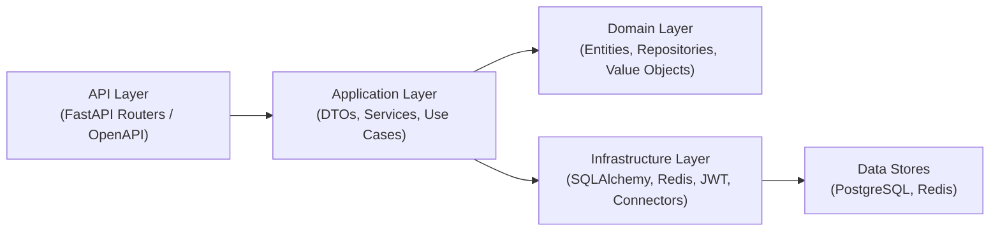

# NexusBI

NexusBI is an enterprise analytics backend built as an extensible, production-ready BI service. The current implementation focuses on a Python FastAPI backend using Clean Architecture patterns, dependency injection, repository-based persistence, DTOs, and JWT-secured REST APIs.

This repository reflects the implemented backend service only and is suitable for API-driven analytics, workspace management, role-based access control, universal SQL execution, chart previews, and PostgreSQL connector discovery.

## Features

### Authentication & Security
- Register new users
- Login with JWT access tokens
- Refresh tokens and session rotation
- Logout and token revocation
- Current authenticated user endpoint
- Role-based access control (RBAC)
- Structured JSON logging for requests and errors

### Enterprise Management
- User management API
- Role management API
- Organization management API
- Workspace management API
- Workspace membership management API

### Analytics & BI
- Dashboard management
- Widget management
- Dataset management
- Report management

### Universal Engines
- Universal Query Engine
  - Validate SQL
  - Execute SQL
  - Explain SQL
  - Dataset preview
- Universal Chart Engine
  - Generate chart drafts
  - Preview chart models
  - Validate chart payloads

### Connector Framework
- PostgreSQL connector implementation
- Connector registry for external data sources
- Connection testing
- Schema discovery
- Table discovery
- Column discovery

## Architecture

NexusBI uses Clean Architecture to strictly separate the API layer from application use cases, domain logic, and infrastructure adapters.

- `app/api` exposes HTTP endpoints, request validation, and OpenAPI metadata
- `app/application` implements DTOs, services, and use case orchestration
- `app/domain` contains core entities, repository interfaces, value objects, and business rules
- `app/infrastructure` provides concrete SQLAlchemy, Redis, connector, JWT, and mapper implementations
- `app/core` manages configuration, dependency injection, middleware, exceptions, and logging

### Architecture Diagram



## Folder Structure

```text
backend/
├── app/
│   ├── api/
│   │   ├── dependencies/
│   │   └── v1/
│   │       └── routers/
│   │           ├── auth.py
│   │           ├── charts.py
│   │           ├── connectors.py
│   │           ├── dashboards.py
│   │           ├── datasets.py
│   │           ├── health.py
│   │           ├── organizations.py
│   │           ├── query.py
│   │           ├── reports.py
│   │           ├── roles.py
│   │           ├── users.py
│   │           ├── widgets.py
│   │           └── workspaces.py
│   ├── application/
│   │   ├── dto/
│   │   ├── interfaces/
│   │   ├── services/
│   │   └── use_cases/
│   ├── core/
│   ├── domain/
│   │   ├── connectors/
│   │   ├── entities/
│   │   ├── repositories/
│   │   └── value_objects/
│   ├── infrastructure/
│   │   ├── chart/
│   │   │   └── builders/
│   │   ├── connectors/
│   │   ├── database/
│   │   ├── mappers/
│   │   ├── query/
│   │   ├── repositories/
│   │   └── services/
│   └── main.py
```

## Technology Stack

- Backend: Python 3.13, FastAPI, SQLAlchemy, Dependency Injector
- Database: PostgreSQL
- Cache: Redis
- API Docs: OpenAPI / Swagger
- Testing: pytest
- Quality Tools: Ruff, MyPy

## API Modules

- **Authentication**: register, login, refresh token, logout, current user
- **User Management**: user listing, retrieval, and profile operations
- **Role Management**: RBAC role CRUD and permission assignment
- **Organization Management**: enterprise organization CRUD
- **Workspace Management**: workspace CRUD and membership APIs
- **Dashboard Management**: dashboard creation, retrieval, update, delete
- **Widget Management**: widget CRUD and layout operations
- **Dataset Management**: dataset CRUD and preview endpoints
- **Report Management**: analytical report lifecycle APIs
- **Universal Query Engine**: SQL validation, execution, explain, dataset preview
- **Universal Chart Engine**: chart generation, preview, validation
- **Connector Framework**: PostgreSQL connector, registry, connection testing, discovery

## Installation

1. Clone the repository:
   ```bash
   git clone https://github.com/<your-org>/NexusBI.git
   cd NexusBI/backend
   ```

2. Create a Python virtual environment:
   ```bash
   python3 -m venv .venv
   source .venv/bin/activate
   ```

3. Install dependencies:
   ```bash
   uv install
   ```

4. Create an environment file:
   ```bash
   cp .env.example .env
   ```
   Update the values for PostgreSQL, Redis, and security settings.

## Environment Variables

The backend loads settings from `.env` and supports environment-specific overrides via `.env.{ENV}`.

Required values for the current backend implementation:

- `SECRET_KEY`
- `ACCESS_TOKEN_EXPIRE_MINUTES`
- `REFRESH_TOKEN_EXPIRE_DAYS`
- `POSTGRES_USER`
- `POSTGRES_PASSWORD`
- `POSTGRES_HOST`
- `POSTGRES_PORT`
- `POSTGRES_DB`
- `REDIS_HOST`
- `REDIS_PORT`
- `REDIS_DB`
- `REDIS_PASSWORD`
- `HOST`
- `PORT`
- `ENV`
- `LOG_LEVEL`

## Running

Start the backend locally:

```bash
cd backend
uv run uvicorn app.main:app --host 0.0.0.0 --port 8000 --reload
```

The API is available at `http://localhost:8000`.

## Testing

Run the quality and test suite with:

```bash
cd backend
uv run ruff check .
uv run ruff format --check .
uv run mypy .
uv run pytest
```

This backend currently includes **923 automated tests**.

## API Documentation

Swagger UI is available at:

- `http://localhost:8000/docs`

OpenAPI schema is available at:

- `http://localhost:8000/openapi.json`

## Project Statistics

- 60+ REST APIs
- 923 Tests
- Clean Architecture
- JWT Authentication
- RBAC
- Query Engine
- Chart Engine
- Connector Framework

## Future Enhancements
The following features are planned for future releases and are **not part of the current implementation**:

- MySQL Connector
- Snowflake Connector
- BigQuery Connector
- AI Copilot
- Frontend Dashboard Builder
- Forecasting
- Scheduled Reports

## License

MIT
