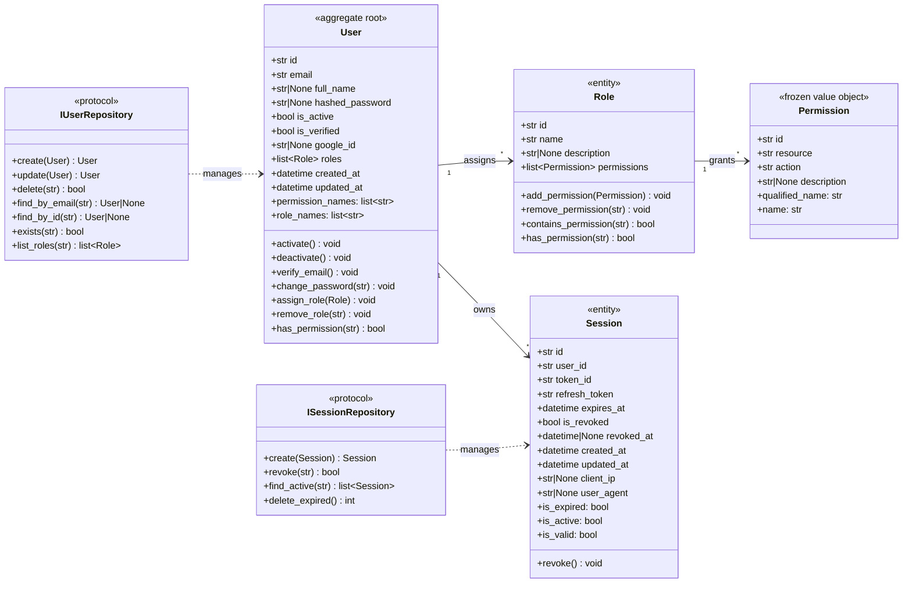

# Authentication Domain Model

> Sprint 2A – Phase 2.1 | Authentication Domain Layer

## Entity Diagram



## Entity Responsibilities

### Permission (Value Object)

| Aspect | Detail |
|---|---|
| **Location** | `backend/app/domain/entities/permission.py` |
| **Type** | Frozen dataclass (immutable value object) |
| **Identity** | Equality by `(resource, action)` tuple |
| **Purpose** | Represents a discrete RBAC privilege on a resource |

A Permission is intentionally **immutable** — once created it can be compared, hashed, and stored in sets without risk of accidental mutation. The `qualified_name` property (`resource:action`) serves as the canonical string identifier across the domain.

### Role (Entity)

| Aspect | Detail |
|---|---|
| **Location** | `backend/app/domain/entities/role.py` |
| **Type** | Mutable dataclass with business methods |
| **Identity** | By `id` field |
| **Purpose** | Groups permissions into an assignable unit |

Roles encapsulate permission management logic (`add_permission`, `remove_permission`, `contains_permission`). A `has_permission` backward-compatible method supports both plain name and `resource:action` lookups.

### User (Aggregate Root)

| Aspect | Detail |
|---|---|
| **Location** | `backend/app/domain/entities/user.py` |
| **Type** | Mutable dataclass with rich domain behavior |
| **Identity** | UUID `id` field |
| **Purpose** | Central identity aggregate owning roles and sessions |

The User entity is the **aggregate root** of the authentication domain. It owns the lifecycle of role assignments and enforces business invariants (non-empty email, password hash validation). All mutation methods automatically bump `updated_at`.

### Session (Entity)

| Aspect | Detail |
|---|---|
| **Location** | `backend/app/domain/entities/session.py` |
| **Type** | Mutable dataclass with lifecycle methods |
| **Identity** | By `id` field |
| **Purpose** | Tracks refresh token sessions for rotation and device binding |

The Session entity manages its own revocation lifecycle. The `revoke()` method is idempotent and sets both `is_revoked` and `revoked_at`. Query predicates (`is_expired`, `is_active`) derive state from timestamps and flags.

## Business Rules

### Construction Invariants

| Entity | Rule | Enforcement |
|---|---|---|
| User | Email must be non-empty | `__post_init__` raises `ValueError` |
| Role | Name must be non-empty | `__post_init__` raises `ValueError` |
| Permission | Immutable after creation | `frozen=True` dataclass |
| User | `change_password()` rejects empty hashes | Method raises `ValueError` |

### Idempotent Operations

| Method | Behavior |
|---|---|
| `User.activate()` | No-op if already active |
| `User.deactivate()` | No-op if already inactive |
| `User.verify_email()` | No-op if already verified |
| `User.assign_role()` | No-op if role ID already assigned |
| `User.remove_role()` | No-op if role ID not present |
| `Role.add_permission()` | No-op if `resource:action` already present |
| `Role.remove_permission()` | No-op if not present |
| `Session.revoke()` | No-op if already revoked |

### Automatic Timestamps

All mutating methods on `User` and `Session` automatically set `updated_at` to `datetime.now(UTC)` when a state change occurs. Idempotent no-ops do **not** bump the timestamp.

## Relationships

```
User ──[1:*]──> Role ──[1:*]──> Permission
User ──[1:*]──> Session
```

- A **User** may hold zero or more **Roles**.
- A **Role** may contain zero or more **Permissions**.
- A **User** may have zero or more active **Sessions**.
- **Permission** equality is structural (`resource:action`), not by `id`.

## Domain Invariants

1. **No duplicate roles** — `User.assign_role()` checks by `role.id` before appending.
2. **No duplicate permissions** — `Role.add_permission()` checks by `qualified_name` before appending.
3. **Email uniqueness** — enforced at the repository layer via `IUserRepository.create()`.
4. **Session validity** — `is_active = not is_revoked and not is_expired`.
5. **Password hash non-empty** — `User.change_password()` validates before assignment.
6. **Permission immutability** — `frozen=True` prevents accidental mutation of value objects.

## Repository Contracts

### IUserRepository (Protocol)

| Method | Returns | Purpose |
|---|---|---|
| `create(user)` | `User` | Persist new user; raise on duplicate email |
| `update(user)` | `User` | Persist mutations of existing user |
| `delete(user_id)` | `bool` | Remove user by ID |
| `find_by_email(email)` | `User \| None` | Lookup by email |
| `find_by_id(user_id)` | `User \| None` | Lookup by UUID |
| `exists(email)` | `bool` | Check email existence |
| `list_roles(user_id)` | `list[Role]` | Get assigned roles |

### ISessionRepository (Protocol)

| Method | Returns | Purpose |
|---|---|---|
| `create(session)` | `Session` | Persist new session |
| `revoke(session_id)` | `bool` | Mark session as revoked |
| `find_active(user_id)` | `list[Session]` | Get non-revoked, non-expired sessions |
| `delete_expired()` | `int` | Purge expired sessions (maintenance) |

> [!NOTE]
> Both interfaces use `typing.Protocol` with `@runtime_checkable` for structural sub-typing. The existing ABC-based contracts in `app.domain.repositories` remain untouched for backward compatibility with Phase 1 use cases.
