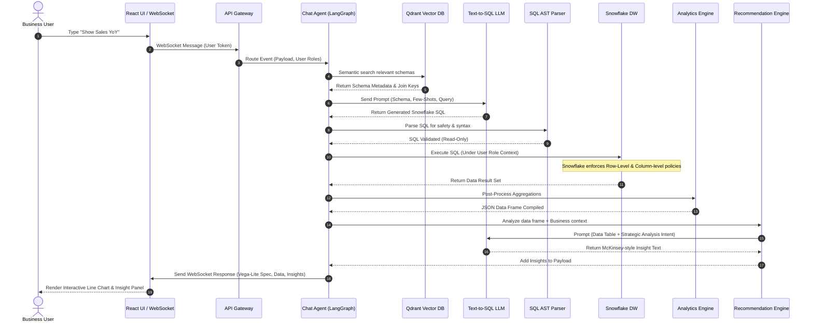
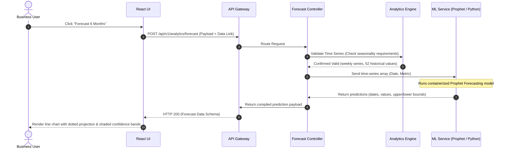
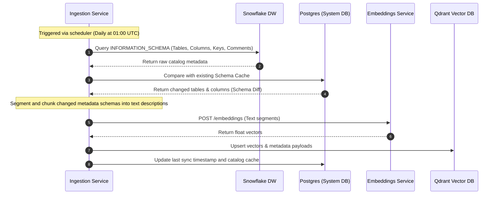

# Software Planning & Architecture Document: NexusBI – Enterprise Analytics Copilot

## 1. Executive Summary

### 1.1 Document Control & Metadata
* **Project Name:** NexusBI – Enterprise Analytics Copilot
* **Document Version:** 1.0.0
* **Author:** Principal Software Architect
* **Status:** Draft for Architecture Review Board (ARB)
* **Date:** July 1, 2026

### 1.2 Enterprise Context & Vision
In the modern enterprise, data is abundant, but insights are scarce. Traditional Business Intelligence (BI) tools (e.g., Tableau, PowerBI, Looker) require users to possess deep knowledge of data schemas, SQL, and specific visualization interfaces. This creates a structural bottleneck: business decision-makers (CEOs, managers, operations leads) must submit tickets to data analyst teams, leading to wait times of days or weeks for relatively simple business questions. 

**NexusBI** is designed to eliminate this bottleneck. It represents a paradigm shift from **pull-based static dashboards** to an **interactive, cognitive conversational analytics assistant**. By leveraging Large Language Models (LLMs), semantic vector-based retrieval, dynamic SQL generation, and statistical engines, NexusBI allows enterprise users to ask natural language questions and receive accurate, interactive visualizations, forecasts, and actionable recommendations derived directly from their Snowflake Data Warehouse in seconds.

```
┌─────────────────┐      ┌─────────────────┐      ┌─────────────────┐
│ Business User   │ ───> │    NexusBI      │ ───> │ Snowflake Cloud │
│ (Natural Lang)  │ <─── │ (AI & Analytics)│ <─── │ Data Warehouse  │
└─────────────────┘      └─────────────────┘      └─────────────────┘
```

### 1.3 Business Value Proposition & Goals
NexusBI delivers immediate, measurable value across three dimensions:
* **Time-to-Insight Reduction:** Reduces the average cycle time for ad-hoc business questions from 5 business days to under 10 seconds.
* **Operational Efficiency:** Frees data analysts from repetitive dashboard maintenance and basic SQL query generation, allowing them to focus on advanced data modeling and strategic analytics pipelines.
* **Democratized Data-Driven Culture:** Empowers non-technical executives to explore data independently, encouraging evidence-based decision-making at all levels of the organization.

#### Key Business Objectives (Year 1):
* **User Adoption:** Achieve a Daily Active User (DAU) to Monthly Active User (MAU) ratio of >40% among target business users.
* **Accuracy SLA:** Maintain a Text-to-SQL translation execution accuracy rate of $\ge 98\%$ on validated enterprise schemas.
* **Cost Efficiency:** Keep AI/LLM API infrastructure costs under \$0.05 per user query through intelligent semantic caching and metadata indexing.
* **Query Latency:** Ensure 90% of natural language queries return visualization and analysis within 5 seconds.

### 1.4 Target Customer Persona Matrix
NexusBI is built for mid-market to enterprise companies ($50M+ annual revenue) that have consolidated their operational and business data into Snowflake but struggle with data accessibility.

| Dimension | Mid-Market Enterprise | Large Fortune 500 Enterprise |
| :--- | :--- | :--- |
| **Data Maturity** | Semi-centralized, starting to use dbt, single Snowflake account. | Centralized Data Lakehouse, multiple Snowflake accounts, complex governance. |
| **Key Pain Points** | Lack of dedicated data analyst headcount; engineering backlog. | Severe analyst bottlenecks, department siloed data, compliance overhead. |
| **Integration Focus** | Direct Snowflake tables, standard SaaS data connectors. | Enterprise semantic layers (dbt, Cube), strict Row/Column-level security. |
| **Typical Verticals** | E-commerce, SaaS, Fintech, Logistics. | Retail, Banking, Healthcare, Manufacturing. |

### 1.5 Problem Statement & Current State Disruption
Current state enterprise BI environments suffer from three fundamental structural flaws:
1. **The SQL Bottleneck:** The translation of business questions to SQL requires human middleware (analysts). Because business questions evolve rapidly, static dashboards fail to capture the long tail of query needs, resulting in endless modification cycles.
2. **Schema Ignorance:** Standard LLMs lack awareness of enterprise database context, database types, business logic definitions (e.g., how "Active Customer" is calculated), and row-level authorization rules. This causes generic AI helpers to hallucinate invalid SQL.
3. **Descriptive vs. Prescriptive Gap:** Modern dashboards only state *what* happened in the past. They do not automatically explain *why* it happened (anomalies), *what* will happen next (forecasting), or *how* to respond (prescriptive recommendations).

NexusBI disrupts this status quo by introducing an AI-first semantic pipeline that acts as a secure translator and statistical engine between the business user and the Snowflake data warehouse.

```
Traditional:  User ──[Ticket]──> Analyst ──[Write SQL]──> Database ──[Format Chart]──> User (Days/Weeks)
NexusBI:      User ──[Natural Language]──> NexusBI Copilot ──[Auto-SQL]──> Snowflake ──> User (Seconds)
```

### 1.6 Business Impact & Success Metrics
Success for NexusBI is defined by quantitative operational and financial metrics:

$$\text{ROI} = \frac{(\text{Hours Saved} \times \text{Blended Analyst Rate}) - \text{NexusBI License/Compute Cost}}{\text{NexusBI License/Compute Cost}} \times 100$$

* **Self-Service Rate:** Percentage of ad-hoc data requests answered by NexusBI without escalation to the data engineering team (Target: $>80\%$).
* **Time Savings:** Cumulative hours saved per month by business managers and analysts (Target: 120 hours/month per business unit).
* **Snowflake Compute Optimization:** Reduction in redundant warehouse queries through NexusBI’s local query semantic cache and optimized compiler structures (Target: $15-20\%$ reduction in compute credits for analytics).

---

## 2. Functional Requirements & User Stories

### 2.1 Functional Areas Mapping
The functional boundaries of NexusBI are structured around six main capabilities:
1. **Semantic Knowledge Bootstrapping:** Ingestion and indexing of database catalogs, schemas, and semantic definitions.
2. **Conversational Interface:** Multi-turn conversational flow with memory, context preservation, and intent parsing.
3. **Secure SQL Compilation:** Deterministic parsing, generation, verification, and execution of Snowflake SQL.
4. **Automated Analytics Engine:** In-memory post-processing, mathematical transformations, forecasting, and anomaly isolation.
5. **Dynamic UI/Visualization Compilation:** Translation of structured query results into interactive, declarative charts.
6. **Enterprise Security & Governance Auditing:** Session audits, PII filtering, permission synchronization, and cost metrics tracking.

### 2.2 Epic-Level Feature Breakdowns

#### Epic 1: Semantic Metadata Sync (ETL)
* **Sync Manager:** Automatic scheduled crawling of Snowflake's `INFORMATION_SCHEMA` and catalog tables.
* **Semantic Layer Integration:** Ingestion of dbt semantic models or Cube schemas to leverage pre-defined joins, dimensions, and measures.
* **Vector Vectorization Pipeline:** Embedding and indexing of metadata definitions into a vector database for semantic search during LLM generation.

#### Epic 2: Conversational Data Exploration (AI Chat)
* **Intent Classifier:** Classifying input into: Data Query, Forecast Request, Anomaly Check, Dashboard Creation, or General Chat.
* **Context Preservation:** Retaining filters, selected metrics, and target segments across a multi-turn conversation.
* **Clarification Loops:** Proactively asking the user questions when a query is ambiguous (e.g., "Do you mean gross revenue or net revenue?").

#### Epic 3: Text-to-SQL Generation & Validation
* **Contextual RAG Retrieval:** Dynamically retrieving the minimal necessary schemas, column descriptions, and join rules for a given query to avoid LLM context bloat.
* **SQL Compiler:** Assembling the system prompt, generating the Snowflake-compliant SQL, parsing it locally for syntax and safety, and correcting errors dynamically.
* **Query Executor:** Running the validated query against Snowflake under the user's specific access rights, returning data frames to the analytics engine.

#### Epic 4: Cognitive Forecasting & Recommendation
* **Statistical Forecaster:** Running predictive time-series models on historical trends.
* **Anomaly Detector:** Automatically identifying spikes, drops, or structural shifts in the query result sets.
* **Prescriptive Copilot:** Generating textual business summaries and recommendations using LLMs grounded in the retrieved numbers.

#### Epic 5: Visual Dashboard Builder
* **Visual Spec Generator:** Generating declarative JSON chart definitions (Vega-Lite / ECharts) matches the nature of the data.
* **Interactive Canvas:** Placing charts onto dynamic grids that users can pin, organize, and export.

### 2.3 Detailed User Stories (Gherkin Format)

#### User Story 1: Text-to-SQL with Ambiguity Resolution
```gherkin
Scenario: A Business Analyst asks a query containing metric ambiguity
  Given the Business Analyst is authenticated and has access to the "SALES_DB" schema
  When they submit the natural language query "Show sales performance for last quarter"
  Then the system identifies "sales" can map to "gross_sales" or "net_revenue"
  And the system prompts the user: "Would you like to analyze Gross Sales or Net Revenue?"
  When the user selects "Net Revenue"
  Then the system generates a validated SQL query targeting "SALES_DB.FACT_SALES" joining "DIM_DATE"
  And executes the query on Snowflake
  And returns the correct data set formatted as a line chart
```

#### User Story 2: Automatic Forecasting on Trend Analysis
```gherkin
Scenario: A Manager requests a forecast based on historical visual data
  Given a Manager is viewing a line chart of monthly revenue for the past 24 months
  When they click the "Forecast Next 6 Months" button or type "Forecast this out"
  Then the Analytics Engine extracts the underlying time-series data
  And verifies there are at least 18 historical data points to support seasonality modeling
  And executes a forecasting model (Prophet-equivalent) on the backend
  And renders the historical data alongside the forecasted trend with a 95% confidence interval band
```

#### User Story 3: Column-Level Masking Enforcement
```gherkin
Scenario: A Data Analyst asks for customer details but is unauthorized for PII
  Given a Data Analyst who does not belong to the "HR_FINANCE" security group
  When they run the query "List the top 10 customers by revenue and show their email addresses"
  Then the SQL Generator retrieves the metadata catalog showing "email" is classified as PII
  And the system intercepts the SQL compilation to enforce masking rules
  And the generated SQL uses `MASK_EMAIL(email)` or excludes the column
  And the result set returned displays the emails as "m***@domain.com" or null
  And a compliance audit record is logged
```

### 2.4 End-to-End Enterprise Business Workflows

#### Workflow A: Ad-Hoc Executive Inquiry to Shared Dashboard
1. **Entry:** CEO types in Chat: "How is our product margin looking this year compared to last year by region?"
2. **Parsing:** Intent classifier routes to Query. Semantic RAG retrieves schema metadata for `fct_orders`, `dim_products`, and `dim_regions`.
3. **SQL Compilation:** SQL generator writes a Snowflake query using `DATEDIFF` and window functions to compute YoY margin percentages.
4. **Execution:** Query runs on Snowflake. The result set returns 8 rows (4 regions, 2 years).
5. **Visualization:** Visualization engine selects a grouped column chart.
6. **Recommendation:** Recommendation engine runs. It observes that the "North" region dropped 4% due to shipping cost increases in Q2.
7. **Action:** CEO pins the chart to the "Executive KPI Board" and shares the workspace URL with the VP of Operations.

#### Workflow B: Automated Data Catalog Sync
1. **Schedule:** Cron job triggers daily metadata synchronization at 01:00 UTC.
2. **Discovery:** Ingestion service queries Snowflake `INFORMATION_SCHEMA.COLUMNS` and `SHOW PRIMARY KEYS` to map relationships.
3. **Analysis:** The system extracts table statistics (row counts, cardinality) and column descriptions.
4. **Embedding:** Schema information is chunked and written into text descriptions (e.g., *"Table: FACT_SALES. Column: NET_AMT. Represents the final sale amount after discounts and taxes."*).
5. **Upsert:** Embeddings are written to Qdrant vector database using cosine similarity indexing.
6. **Logging:** Sync status and schema diffs are written to the system database, updating the semantic schema catalog cache.

### 2.5 Edge Case Handling & Error Workflows

```
                           ┌─────────────────────────┐
                           │    User Query Input     │
                           └─────────────────────────┘
                                        │
                                        ▼
                             [Parse SQL Generator]
                                        │
                         ┌──────────────┴──────────────┐
                         ▼ Error                       ▼ Success
             ┌───────────────────────┐       ┌───────────────────┐
             │ LLM Error Detection   │       │  Execute Query    │
             │     & Self-Healing    │       └─────────┬─────────┘
             └───────────┬───────────┘                 │
                         │                             ▼
                         │                    [Data Out of Bounds /]
                         │                    [Snowflake Timeout   ]
                         │                             │
                         │                             ▼
                         └──────────────────────>  Fallback UI 
                                                 (Friendly Error)
```

* **Snowflake Warehouse Suspended / Cold Start:** If the target warehouse is suspended, Snowflake may take 5–15 seconds to resume. The execution layer captures the state, updates the user UI with a "Resuming Snowflake Compute Warehouse..." status bar, and extends the API gateway timeout threshold to prevent HTTP 504.
* **SQL Compilation Syntax Errors:** If the generated SQL fails execution on Snowflake due to a syntax error, the compiler catches the driver exception, attaches the failing SQL and the compiler error log, and feeds them back into the LLM context for an automated "self-healing" correction loop (maximum 2 retries).
* **LLM Context Overflow on Large Schemas:** If a database has 500+ tables, the system will not dump the entire schema into the prompt. The metadata router uses a vector search to select only the top 10-15 tables related to the user's intent. If key join relationships are missing, it falls back to a structural graph search (Dijkstra algorithm) over foreign keys to find the shortest join path, appending the selected join schema.

---

## 3. Non-Functional Requirements (NFRs)

### 3.1 Performance
* **Query Latency Profile:**
  * Intent classification and semantic metadata retrieval: $\le 800\text{ ms}$.
  * LLM SQL Generation (first token to compile): $\le 1.5\text{ seconds}$.
  * Snowflake metadata cache lookup: $\le 100\text{ ms}$.
  * Network overhead and visual rendering serialization: $\le 500\text{ ms}$.
  * Total system-level overhead (excluding Snowflake query execution time): $\le 3.0\text{ seconds}$ at $p95$.
* **Concurrency:** The backend application architecture must support $\ge 500$ concurrent active WebSockets/REST connections per node, auto-scaling up to 10,000 concurrent sessions globally.
* **Semantic Caching:** Cache SQL queries and their mathematical data representation based on hash-matching of the semantic intent, with a time-to-live (TTL) of 1 hour to prevent redundant Snowflake execution costs.

### 3.2 Scalability
* **Stateless Backend Nodes:** All API, Analytics, and SQL-generation microservices must remain completely stateless. User session states must reside in Redis cluster instances.
* **Horizontal Auto-Scaling:** Deploy backend services on Kubernetes (EKS/GKE) utilizing Horizontal Pod Autoscalers (HPA) triggered by CPU utilization ($>70\%$) or request concurrency limits ($>150$ concurrent requests per pod).
* **Elastic Snowflake Compute Integration:** Implement routing rules that send heavy analytics and forecasting requests to a dedicated large Snowflake warehouse (`L` or `XL`), while routing lightweight checks to a shared small warehouse (`S` or `M`).

### 3.3 Security & Compliance

```
┌──────────────────┐      HTTPS / TLS 1.3      ┌──────────────────┐
│  Client Browser  │ ────────────────────────> │  API Gateway /   │
└──────────────────┘                           │  OIDC Identity   │
                                               └────────┬─────────┘
                                                        │ JWT Validated
                                                        ▼
┌──────────────────┐    Enforced RBAC & RLS    ┌──────────────────┐
│ Snowflake DB     │ <──────────────────────── │  Backend Service │
│ (Key-Pair Auth)  │                           └──────────────────┘
└──────────────────┘
```

* **Authentication & Identity Integration:** Mandatory integration with enterprise identity providers via OIDC/SAML 2.0 (e.g., Okta, Ping Identity, Azure AD). Use secure JSON Web Tokens (JWT) using RS256 signing keys.
* **Role-Based Access Control (RBAC):** Map user directory groups (e.g., `AD_FINANCE_ANALYSTS`) to specific application roles and Snowflake roles via identity token claims.
* **Snowflake Credentials Protection:** The application must never store general write passwords. Connections to Snowflake must be established using Key-Pair Authentication (JSON Web Tokens using a 2048-bit private key rotated every 90 days), with the key stored securely in Vault.
* **Data Privacy & PII Handling:** Prevent raw PII from reaching public LLM APIs. The SQL Generator intercepts query configurations and applies tokenization or hashing on columns flagged as PII (`SSN`, `IP_ADDRESS`, `CREDIT_CARD`, `EMAIL`) prior to semantic vectorization or prompt construction.
* **Compliance Standards:** Implement auditing, data protection, and encryption controls to maintain SOC 2 Type II, GDPR, and HIPAA compliance. Data transit must be secured with TLS 1.3, and data at rest encrypted using AES-256 GCM.

### 3.4 Reliability, Availability, & Disaster Recovery
* **High Availability SLA:** Maintain a minimum of $99.95\%$ uptime for the control plane and API endpoints, calculated monthly.
* **Redundancy:** Multi-region, active-active deployment across at least two cloud regions (e.g., AWS `us-east-1` and `us-west-2`).
* **Disaster Recovery Parameters:**
  * **Recovery Point Objective (RPO):** $< 5\text{ minutes}$ for metadata and configuration parameters (using continuous database replication).
  * **Recovery Time Objective (RTO):** $< 15\text{ minutes}$ for traffic failover utilizing Route53 multi-value routing or Cloudflare Load Balancing.
* **Graceful Degradation:** If downstream AI APIs (e.g., OpenAI or Anthropic) experience outages, the system must automatically failover to a secondary LLM provider (e.g., Amazon Bedrock or self-hosted Llama-3-70B on vLLM clusters).

### 3.5 Maintainability, Extensibility, & Technical Debt Mitigation
* **Separation of Concerns:** Strictly enforce a clean architecture pattern dividing code into Domain, Application, Infrastructure, and Interface layers.
* **Semantic Layer Extensibility:** Design the schema ingestion engine using a provider-factory pattern, enabling the application to swap out or add metadata ingestion drivers (e.g., dbt, Cube, LookML, or raw Snowflake schemas) without modifying downstream query generation logic.
* **Test Coverage Thresholds:** Unit test coverage $\ge 85\%$; integration test coverage $\ge 70\%$ for core compilers. Integration tests must use mock Snowflake connectors and mock LLM API interfaces.

### 3.6 Observability & Audit Trails
* **Comprehensive LLM Audit Logs:** Save every transaction query containing: Raw user prompt, resolved metadata context, generated SQL, system corrections, Snowflake execution time, token counts (prompt, completion, total), and associated cost.
* **Distributed Tracing:** Inject OpenTelemetry context headers across all microservices to trace request paths from frontend WebSockets through AI compilers and down to database drivers.
* **System Metrics Dashboarding:** Centralize logs using Grafana Loki and Prometheus, tracking memory, container health, vector index latencies, and API error rates.

---

## 4. System Scope & Product Boundaries

```
┌───────────────────────────────────────┐
│        IN-SCOPE (Version 1)           │
│  - Single Data Warehouse (Snowflake)  │
│  - Text-to-SQL Compiler               │
│  - Interactive Vega-Lite Charts       │
│  - Out-of-the-Box Forecasting        │
└───────────────────────────────────────┘
                   │
                   ▼
┌───────────────────────────────────────┐
│       OUT-OF-SCOPE (Version 1)        │
│  - Multi-Database Joins (e.g. Postgres)│
│  - Direct Write Back / Data Insertion │
│  - Custom Machine Learning Training   │
│  - Static PDF Reporting Engine        │
└───────────────────────────────────────┘
```

### 4.1 In-Scope Features for MVP (V1)
* **Single-Source Data Integration:** Native connectivity to Snowflake Data Warehouses.
* **Text-to-SQL Generator:** LLM-powered compiler converting natural language into Snowflake SQL queries.
* **Metadata Schema Crawling:** Automated ingestion of tables, columns, descriptions, primary keys, and foreign keys.
* **Multi-Turn Analytics Chat:** Conversation memory allowing refining filters and drilling down.
* **Dynamic Chart Rendering:** Visual compiler generating Vega-Lite JSON specifications rendered dynamically in React.
* **Time-Series Forecasting:** Automated execution of Prophet / ARIMA models based on retrieved numerical history.
* **Interactive Dashboard Customization:** Ability to name, arrange, pin, and delete charts from personal or shared workspaces.
* **Audit Trail Log:** Centralized UI showing admin query histories, token costs, and compute durations.

### 4.2 Out-of-Scope Features for MVP (V1)
* **Cross-Database Joins:** Joining a Snowflake table directly with a PostgreSQL or MongoDB collection in real-time. (Deferred to V2).
* **Write-Back Capabilities:** Allowing users to issue write commands (e.g., `INSERT`, `UPDATE`, `DELETE`, `DROP`) via natural language. NexusBI V1 is strictly read-only.
* **Custom ML Model Training UI:** Building or uploading proprietary deep learning model architectures from the UI.
* **Static PDF Reporting Engines:** Heavy PDF report schedulers running server-side Headless Chrome instances to email static files.
* **Direct Integration with Legacy ERP systems:** Proprietary connector building for SAP, Oracle EBS, or Salesforce APIs (all data must reside in Snowflake first).

### 4.3 Boundaries and Constraints
* **Snowflake Schema Restrictions:** The V1 sync engine supports schemas containing up to 1,000 tables. Beyond this limit, manual whitelisting of target schemas via the admin panel is mandatory to prevent vector index database exhaustion.
* **Language Constraint:** The V1 natural language processing pipeline is optimized exclusively for English. Non-English queries will be rejected or passed to fallback translation middleware.
* **Max Result Set Egress:** The application enforces a hard limit of 50,000 rows returned from Snowflake to the analytics engine per query to prevent memory exhaustion of backend services. Aggregations must be pushed down to Snowflake.

---

## 5. Detailed User Roles & Permissions Matrix

### 5.1 Persona Profiles & Goals

#### 1. Chief Executive Officer (CEO)
* **Goal:** High-level strategic tracking of company health, revenue trends, and operational margin.
* **Usage Pattern:** Asks broad natural language questions, reads AI recommendations, views high-level dashboard summaries, pins visualizations.
* **Tech Skills:** Non-technical. Relies completely on natural language and click interactions.

#### 2. Business Analyst
* **Goal:** Investigating market trends, analyzing customer segment cohorts, compiling monthly reports.
* **Usage Pattern:** Uses conversational drill-downs, refines filters via chat, exports CSVs of raw data behind charts, configures forecasts.
* **Tech Skills:** Basic Excel/analytics software exposure but limited SQL skills.

#### 3. Manager
* **Goal:** Tracking operational metrics for their specific department (e.g., Supply Chain, Regional Sales).
* **Usage Pattern:** Views shared dashboards, asks queries limited to their department's data, configures automatic daily anomaly alerts.
* **Tech Skills:** Intermediate. Relies on visualization tools and needs domain-specific insights.

#### 4. Data Analyst / Engineer
* **Goal:** Maintaining schema integrity, managing semantic definition mappings, verifying SQL generation outputs.
* **Usage Pattern:** Audits generated SQL queries, edits semantic descriptions of columns, updates joins, sets up database connection credentials.
* **Tech Skills:** Advanced. Expert in SQL, dbt, database architecture, and data engineering pipelines.

#### 5. System Administrator (Admin)
* **Goal:** Platform monitoring, security compliance enforcement, user access management, LLM cost management.
* **Usage Pattern:** Manages RBAC groups, monitors token usage, rotates Snowflake credentials, configures vector sync schedules.
* **Tech Skills:** Advanced. System configuration, security protocols, cloud management.

### 5.2 Role-Based Access Control (RBAC) Matrix

| Feature / Module | CEO | Business Analyst | Manager | Data Analyst | Admin |
| :--- | :--- | :--- | :--- | :--- | :--- |
| **Ask Natural Language Queries** | Yes | Yes | Yes (Restricted) | Yes | Yes |
| **Pin / Modify Dashboards** | Yes | Yes | Yes | Yes | Yes |
| **Export Data (CSV / JSON)** | No | Yes | Yes | Yes | Yes |
| **Run Predictive Forecasting** | Yes | Yes | Yes | Yes | Yes |
| **Edit Metadata Semantic Layer** | No | No | No | Yes | Yes |
| **Configure DB Connections** | No | No | No | No | Yes |
| **View Cost & Audit Logs** | No | No | No | Yes (Read-only) | Yes |
| **Manage User Accounts / Roles**| No | No | No | No | Yes |

### 5.3 Row-Level Security (RLS) & Column-Level Security (CLS) Enforcement
To protect sensitive enterprise data, NexusBI integrates directly with Snowflake's native access control mechanisms rather than attempting to compute permissions within the application middleware.

```
                  ┌────────────────────────────────┐
                  │   User Identity (JWT Claims)   │
                  └───────────────┬────────────────┘
                                  │
                                  ▼
┌──────────────────────────────────────────────────────────────────┐
│                      NexusBI Backend Engine                      │
│                                                                  │
│  1. Retrieve User DB Role (e.g. REGION_US_WEST)                  │
│  2. Attach User Role context to Snowflake Client Session         │
│  3. Execute Compiled SQL:                                        │
│     "USE ROLE REGION_US_WEST; SELECT * FROM FACT_SALES..."       │
└─────────────────────────────────┬────────────────────────────────┘
                                  │
                                  ▼
┌──────────────────────────────────────────────────────────────────┐
│                      Snowflake Data Engine                       │
│                                                                  │
│  - Enforces Native Row-Level Security Policy (Filters rows)      │
│  - Enforces Native Column-Level Masking Policies (Masks PII)     │
└──────────────────────────────────────────────────────────────────┘
```

1. **User Identity Propagated to Query context:** When a user logs in via OIDC, their JWT payload contains their mapped Snowflake Role (e.g., `FINANCE_READ_ROLE` or `WEST_COAST_SALES_ROLE`).
2. **Session Parameterization:** During SQL execution, the NexusBI query broker uses the specific Snowflake connection pool assigned to that role, or issues a parameterization command:
   ```sql
   USE ROLE <user_mapped_snowflake_role>;
   ```
3. **Snowflake Native Enforcement:**
   * **RLS:** If Snowflake has a Row Access Policy on the `FACT_ORDERS` table (e.g., filtering by `region_id = 'US-WEST'`), the returned query dataset naturally contains only authorized rows.
   * **CLS:** If a Column Masking Policy is active on `Social_Security_Number` in the database, the returned data values will be masked natively before leaving the Snowflake boundary.

---

## 6. Core Module Specifications

```
┌────────────────────────────────────────────────────────────────────────┐
│                        NEXUSBI CORE PLATFORM                           │
│                                                                        │
│  ┌───────────────────────┐   ┌───────────────────┐   ┌──────────────┐  │
│  │  Auth & OIDC Module   │   │  AI Chat Module   │   │ SQL Gen RAG  │  │
│  └───────────────────────┘   └───────────────────┘   └──────────────┘  │
│  ┌───────────────────────┐   ┌───────────────────┐   ┌──────────────┐  │
│  │   Analytics Engine    │   │ Forecasting ML    │   │ Recs Engine  │  │
│  └───────────────────────┘   └───────────────────┘   └──────────────┘  │
│  ┌───────────────────────┐   ┌───────────────────┐   ┌──────────────┐  │
│  │   Dashboard Canvas    │   │  ETL Sync Catalog │   │ Observability│  │
│  └───────────────────────┘   └───────────────────┘   └──────────────┘  │
└────────────────────────────────────────────────────────────────────────┘
```

### 6.1 Authentication & Authorization Module
* **Technical Design:** Standard stateless OAuth2 authorization flow. Integrates with Keycloak, Auth0, or corporate Active Directory/Okta endpoints.
* **Workflow:**
  1. User attempts access -> Redirected to Identity Provider (IdP).
  2. IdP issues Authorization Code -> Backend verifies and exchanges code for an ID token, Access Token, and Refresh Token.
  3. Tokens stored in secure HTTP-only cookies.
  4. Roles/Groups claims mapped to application-internal permissions using a dynamic authorization handler middleware.

### 6.2 AI Chat & Semantic Parsing Module
* **Technical Design:** A WebSocket-based conversational router utilizing LangGraph for structured agent state machine processing.
* **Component Architectures:**
  * **Intent Router:** Analyzes the prompt to classify the requested action.
  * **Memory Manager:** Retrieves past conversation history from a Redis database. Uses sliding window token compaction to preserve key context attributes (filters, selected dimensions) while discarding raw query outputs to prevent context window bloating.
  * **System Prompt Generator:** Compiles the system instructions, conversation context, current time parameters, and user permissions before dispatching to the LLM.

### 6.3 Text-to-SQL Generator Module
* **Technical Design:** A multi-step retrieval-augmented compiler featuring query validation and automated self-healing.
* **Workflow Details:**

```
                                    ┌───────────────────────┐
                                    │  Natural Lang Query   │
                                    └───────────┬───────────┘
                                                │
                                                ▼
┌──────────────────┐  Schema Maps   ┌───────────────────────┐
│ Vector Database  │───────────────>│  RAG Schema Selector  │
│  (Qdrant Index)  │                └───────────┬───────────┘
└──────────────────┘                            │ Filtered Metadata
                                                ▼
                                    ┌───────────────────────┐
                                    │ SQL Generation Engine │
                                    └───────────┬───────────┘
                                                │ Raw SQL
                                                ▼
                                    ┌───────────────────────┐
                                    │ Local AST SQL Parser  │
                                    └───────────┬───────────┘
                                                ├──────────────────────┐
                                                │ Clean / Safe         │ Syntax Error
                                                ▼                      ▼
                                    ┌───────────────────────┐┌──────────────────┐
                                    │ Snowflake Dry-Run     ││ Diagnostic LLM  │
                                    └───────────┬───────────┘│    Self-Heal     │
                                                │            └─────────┬────────┘
                                                ▼                      │
                                            [Execute] <────────────────┘
```

1. **RAG Schema Selector:** User prompt is embedded (using `text-embedding-3-small`). Vector search finds relevant tables and columns in the metadata vector store.
2. **Context Assembly:** Generates a structured Markdown context detailing:
   * Target table definitions, keys, and joins.
   * Business rules (e.g., *"Active User = users who logged in within the last 30 days"*).
   * 3-5 static few-shot Text-to-SQL examples matching the query pattern.
3. **LLM Generation:** Calls the primary LLM (e.g., Anthropic Claude 3.5 Sonnet) requesting SQL output matching Snowflake syntax rules.
4. **Local AST SQL Parser:** Validates the SQL structure using `sqlglot` or `pglast` parser libraries to check for syntax errors and enforce a strict whitelist of read-only operations (`SELECT`). Blocks destructive command patterns (e.g., semi-colons, `UNION` containing system tables, or write commands).
5. **Snowflake Dry-Run Execution:** Compiles the SQL as an explain plan statement:
   ```sql
   EXPLAIN USING TEXT <generated_sql>;
   ```
   If Snowflake rejects the plan, the parser captures the driver exception stack and loops back to a Self-Healing agent context for correction.

### 6.4 Analytics & Aggregation Engine Module
* **Technical Design:** Dynamic runtime engine executing statistical aggregation and post-retrieval metrics formatting.
* **Key Features:**
  * **Aggregation Pushdown:** Instructs the SQL generator to run heavy math calculations (such as `SUM`, `AVG`, `STDDEV`, percentile distributions) directly in Snowflake, avoiding raw data egress.
  * **Virtual DataFrame Processor:** Runs a lightweight pandas/polars execution sandbox inside the backend container to execute post-retrieval actions (e.g., custom column calculations, pivoting, grouping of small result sets).
  * **In-Memory Caching:** Serializes datasets to Apache Arrow format for rapid transmission to the frontend visualization layer.

### 6.5 Forecasting Module
* **Technical Design:** Automated machine learning pipeline for time-series forecasting.
* **Component Architectures:**
  * **Time-Series Validator:** Inspects the structure of the retrieved dataset. It requires a datetime dimension, a metric column, and a minimum density of data points (e.g., 36 weekly data points or 12 monthly points).
  * **Predictive Pipeline Executor:** Utilizes an integrated statistical service (running a containerized python service with Prophet or statsmodels Auto-ARIMA).
  * **Prediction Intervals Compilation:** Outputs forecasted values, upper prediction intervals, and lower prediction intervals as structured JSON data frames.

### 6.6 Recommendation Engine Module
* **Technical Design:** LLM reasoning agent utilizing chain-of-thought analysis to extract business insights from data tables.
* **Workflow:**
  1. The module receives the final execution dataset and the original user intent.
  2. It formats the data table as a condensed JSON representation.
  3. It executes a business heuristic analyzer to find:
     * High/low outliers (e.g., *"Product X grew 300% in region Y"*).
     * Seasonality anomalies (e.g., *"Sales dropped 20% compared to typical July trends"*).
     * Trend correlations (e.g., *"Marketing spend and revenue diverged in Q3"*).
  4. The LLM processes this information with a system prompt optimized for McKinsey-style executive summaries, returning 3 structured business recommendations.

### 6.7 Interactive Dashboard & Visualizations
* **Technical Design:** Declarative visualization generator using Apache ECharts or Vega-Lite schemas.
* **Chart Compilation Pipeline:**
  1. Analyze data types: Categorical columns, datetime columns, numeric columns, and row counts.
  2. Determine the optimal chart type based on a deterministic heuristic:
     * 1 Datetime + 1 Metric -> **Line Chart**
     * 1 Categorical + 1 Metric -> **Bar Chart**
     * 2 Categorical + 1 Metric -> **Grouped or Stacked Bar Chart**
     * 2 Metrics -> **Scatter Plot**
  3. Generate the Vega-Lite JSON schema mapping the data fields to the visual encoding coordinates (`x`, `y`, `color`, `tooltip`).
  4. Send the declarative schema to the React frontend, which renders it using native web workers.

### 6.8 ETL/ELT & Metadata Ingestion Module
* **Technical Design:** Asynchronous celery tasks synchronized via a scheduling broker.
* **Sync Pipeline:**
  ```
  [Cron Trigger / Webhook]
             │
             ▼
  [Snowflake Catalog Crawl] ───> Extract Tables, Columns, Comments
             │
             ▼
  [dbt Semantic Parse] ────────> Extract Measures, Dimensions, Joins
             │
             ▼
  [Metadata Merger] ───────────> Generate Markdown Definitions
             │
             ▼
  [Vector Embedding Ingest] ───> Upsert to Qdrant Vector Store
  ```

### 6.9 Observability, Audit, & Cost Monitoring Module
* **Technical Design:** Logging broker capturing cost, latency, and lineage indicators.
* **Metrics Ingestion Schema:**
  * **Snowflake credit tracking:** Queries `INFORMATION_SCHEMA.QUERY_HISTORY` for the generated Query ID to retrieve execution duration and warehouse size, converting it to credits spent.
  * **LLM token logging:** Captures input tokens, output tokens, model identifier, and cost according to provider pricing cards.
  * **Audit Lineage:** Saves the direct mapping of target columns read in each user session, creating a dynamic data catalog usage dashboard.

### 6.10 Administration & Governance Module
* **Technical Design:** React-based admin control panel backed by dedicated admin API endpoints.
* **Capabilities:**
  * **Datasource Administration:** Setup Snowflake account URLs, warehouses, client authentication, and default timeout settings.
  * **Schema Manager:** Enable/Disable specific databases, schemas, or tables from the search index.
  * **Glossary Editor:** Add custom business definitions (e.g., *"Churn Rate = users who canceled within 90 days"*), ensuring the SQL generator references these definitions in system prompts.

---

## 7. High-Level Architecture & Data Flows

### 7.1 Architecture Design Philosophy
The system is designed around **Domain-Driven Design (DDD)** and **Clean Architecture** patterns. 
All core calculations, business rules, and compiling functions are isolated in a pure domain layer, shielded from database infrastructure, API frameworks, and cloud provider details.
The communication between service domains (e.g., Query Compilation to Ingestion) utilizes an event-driven architecture using Kafka or Redis Streams for message brokers.

### 7.2 Core High-Level Architecture Diagram
The following architectural diagram illustrates the components of the NexusBI platform and their boundaries:

```mermaid
graph TB
    subgraph Client Layer
        Browser[Client Browser: React / WebSockets]
    end

    subgraph Gateway & Security Layer
        LB[Cloud Load Balancer / WAF]
        Auth0[OIDC / Okta Identity Provider]
        Gateway[API Gateway / BFF Service]
    end

    subgraph Application Service Mesh
        ChatService[AI Chat & State Manager]
        SQLGen[Text-to-SQL Compiler]
        AnalyticsEngine[Analytics & Post-Processor]
        ForecastingService[Forecasting & ML Container]
        RecommendationService[Cognitive Recs Service]
        IngestionService[Metadata Sync Engine]
    end

    subgraph Data & Storage Layer
        Redis[Redis Cache & WebSocket Sessions]
        Postgres[PostgreSQL Metadata & Audit Store]
        Qdrant[Qdrant Vector Database]
        Snowflake[(Snowflake Data Warehouse)]
    end

    %% Flow Arrows
    Browser ──>|HTTPS / WS| LB
    LB ──> Auth0
    LB ──> Gateway
    Gateway ──> ChatService
    
    ChatService ──>|Session State| Redis
    ChatService ──>|RAG Query| Qdrant
    ChatService ──> SQLGen
    SQLGen ──> AnalyticsEngine
    AnalyticsEngine ──> ForecastingService
    AnalyticsEngine ──> RecommendationService
    
    SQLGen ──>|Query Execution / RBAC| Snowflake
    IngestionService ──>|Metadata Crawler| Snowflake
    IngestionService ──>|Upsert Vectors| Qdrant
    
    %% Storage relations
    ChatService ──>|Logs & Audits| Postgres
    SQLGen ──>|Audit Logs| Postgres
```

### 7.3 End-To-End Sequence Diagrams

#### Sequence 1: Natural Language Query Execution Flow
The following sequence details how a user's question is parsed, validated, run, visualized, and analyzed:



#### Sequence 2: Forecasting Pipeline Execution Flow
This sequence details how a prediction request is verified, modeled, and returned:



#### Sequence 3: Metadata Catalog Sync Flow
This sequence shows how changes in the Snowflake schema are identified and indexed in the vector database:



### 7.4 Detailed Data Flow Description
Data flows through the system in four core phases:
1. **Ingestion and Preparation (Control Plane):** Metadata is pulled from Snowflake and stored in PostgreSQL (structured cache) and Qdrant (vector index). No production business data is pulled at this phase, only metadata.
2. **Translation & Verification Plane:** The user's query is analyzed by a semantic parser, which fetches context from Qdrant, compiles a prompt, gets SQL back from the LLM, parses the AST to block destructive code, and performs an explain plan call.
3. **Execution Plane (Snowflake pushdown):** The validated SQL is sent directly to Snowflake via TLS 1.3 under the user's specific database role. The Snowflake warehouse processes the queries and returns the aggregated dataset.
4. **Post-Processing & Presentation Plane:** The raw dataset is pivoted, mapped to visual schemas, analyzed for outliers, and compiled into a single JSON payload. The client's browser renders the visualization canvas.

---

## 8. Recommended Technology Stack & Justification

```
┌────────────────────────────────────────────────────────┐
│               RECOMMENDED TECH STACK                   │
│                                                        │
│  Frontend: React / Redux Toolkit / Apache ECharts      │
│  Backend:  FastAPI (Python) / Celery / WebSockets      │
│  Database: Snowflake (OLAP) / Postgres (OLTP / Metadata)│
│  Vector:   Qdrant (Vector DB) / Redis (Cache)          │
│  AI Engine:LangGraph / Claude 3.5 Sonnet / Llama 3     │
│  DevOps:   Docker / Kubernetes / Terraform / Prometheus│
└────────────────────────────────────────────────────────┘
```

### 8.1 Backend Tier
* **Primary Language: Python 3.11**
  * *Justification:* Python is the industry standard for AI integration, data manipulation, and scientific libraries. The forecasting modules require libraries (pandas, polars, Prophet) that are native to Python.
* **Web Framework: FastAPI**
  * *Justification:* FastAPI offers asynchronous capabilities, high execution speed (comparable to Go or Node.js under ASGI), automatic OpenAPI documentation, and native pydantic validation schemas.
* **Message Queue: Celery with Redis Broker**
  * *Justification:* Necessary for offloading heavy, asynchronous processes (such as PDF generation, metadata ingestion syncs, and model calculations) away from the main API thread.

### 8.2 Frontend Tier
* **UI Library: React 18+**
  * *Justification:* Rich ecosystem, component reusability, virtual DOM optimization, and massive community support.
* **State Management: Redux Toolkit (RTK)**
  * *Justification:* NexusBI maintains complex frontend state (chat history, chart specifications, active filters, current workspace layouts, synchronization flags). RTK provides a predictable state container with built-in middleware capabilities.
* **Styling: Tailwind CSS**
  * *Justification:* Utility-first CSS framework enabling fast UI development, consistent theme design (supporting dark mode natively), and low build-size overhead.

### 8.3 Database & Storage Tier
* **Analytical Engine: Snowflake Cloud Data Warehouse**
  * *Justification:* Highly scalable cloud analytics engine. Supports key parameters needed for enterprise BI: native compute scaling (automatic warehouses), key-pair security, column masking, row policies, and fast execution over petabyte-scale data.
* **Metadata Database: PostgreSQL 15+**
  * *Justification:* Structured, reliable relational database with ACID compliance. Ideal for holding user account roles, workspace layouts, audit logs, cached metadata definitions, and sync states.
* **Cache Database: Redis Cluster**
  * *Justification:* High-speed in-memory database used for session management, WebSocket connection registries, and temporary query result caching.

### 8.4 Artificial Intelligence & LLM Tier
* **Primary Orchestration Framework: LangGraph & LlamaIndex**
  * *Justification:* LangGraph allows building stateful, multi-agent workflows with loops (crucial for SQL compilation and self-healing validation checks). LlamaIndex is utilized for unstructured schema document chunking and vector indexing.
* **Primary LLM Model: Anthropic Claude 3.5 Sonnet**
  * *Justification:* Outperforms other models on code generation, logical reasoning, and structured SQL creation tasks. Provides a 200k context window, enabling ingestion of schema context tables.
* **Vector Database: Qdrant**
  * *Justification:* Specialized high-performance vector search engine with rich filtering options (e.g., searching embeddings restricted to a specific user tenant ID).

### 8.5 Visualization Tier
* **Visualization Engine: Apache ECharts & Vega-Lite**
  * *Justification:* Vega-Lite provides a declarative JSON schema system that maps well to LLM text generation outputs. Apache ECharts provides smooth 60fps canvas/SVG rendering, rich transitions, mobile responsiveness, and support for thousands of interactive data points in the client browser.

### 8.6 Deployment & Infrastructure Tier
* **Containerization: Docker**
  * *Justification:* Standardization of execution environments between developer machines and production servers, isolating Python mathematical dependencies.
* **Orchestration: Kubernetes (EKS / GKE)**
  * *Justification:* Native support for microservice architectures, blue-green rolling deployments, automated container scaling, and self-healing.

### 8.7 CI/CD & DevOps Tier
* **Infrastructure as Code (IaC): Terraform**
  * *Justification:* Declares cloud infrastructure (AWS/GCP, Kubernetes clusters, Qdrant instances, Postgres RDS) in standard configuration files, preventing configuration drift across staging, QA, and production.
* **CI/CD Pipeline: GitHub Actions**
  * *Justification:* Integrated toolchain execution (linting with Ruff, unit testing, Docker image building, scanning with Trivy, and deployment to staging K8s clusters).

---

## 9. Risks & Mitigation Strategies

### 9.1 Technical Risks

#### Risk 1: LLM Hallucinations in SQL Generation
* *Impact:* High (Business users receive incorrect data charts, leading to bad business decisions).
* *Mitigation:*
  1. **Strict Context Isolation:** Never rely on the LLM's pre-trained knowledge for database structure. Inject exact metadata schemas, column lists, and relations.
  2. **Schema Verification & AST Parsing:** Check SQL syntax locally before sending to Snowflake.
  3. **Metadata Mapping (dbt):** Require the use of a semantic mapping file where key calculations are pre-coded.
  4. **Dry-Run Validation:** Execute `EXPLAIN` on Snowflake to confirm validity.

#### Risk 2: LLM API Cost Escalation
* *Impact:* Medium (Platform running costs become unstably high).
* *Mitigation:*
  1. **Intent Filtering:** Block general chat conversations. Route only structured analytical requests to Claude 3.5 Sonnet.
  2. **Model Tiering:** Route simple tasks (e.g., chart configuration generation, database schema selection) to cheaper models (e.g., GPT-4o-mini or Claude 3 Haiku). Route only the final SQL generation step to Claude 3.5 Sonnet.
  3. **Semantic Caching:** Cache generated SQL. If a user asks the same question or a slight variation within 1 hour, reuse the cached response.

#### Risk 3: Data Latency and Egress Performance
* *Impact:* High (Long waiting spinners, poor user experience).
* *Mitigation:*
  1. **Enforced Pagination and Limits:** Set hard limits (`LIMIT 50000`) on raw query result size.
  2. **Server-Side Aggregations:** Enforce pushdowns of group-by calculations.
  3. **Apache Arrow Serialization:** Stream database results to the backend application container using Apache Arrow formats, bypassing sluggish JSON serialization paths.

### 9.2 Business Risks

#### Risk 1: Low User Adoption
* *Impact:* High (Enterprise clients cancel subscriptions).
* *Mitigation:*
  1. **Proactive Clarification:** Build conversational helper loops so non-technical users do not get stuck on blank input fields.
  2. **Out-of-the-box Templates:** Pre-populate the user homepage with common standard query suggestions (e.g., *"Show our top 10 products by growth rate"*).
  3. **Interactive Demos:** Provide interactive walkthrough popups on first login.

#### Risk 2: Compliance and Security Rejection
* *Impact:* High (Enterprise Security / InfoSec teams block deployment).
* *Mitigation:*
  1. **Zero Raw-Data Storage:** Do not store business database results on the NexusBI system database. Keep data strictly in-memory during transaction execution, and discard it once sent to the client.
  2. **PII Masking at Source:** Enforce masking before vectors are embedded or sent to external AI provider endpoints.
  3. **Self-Hosted LLM Option:** Offer enterprise customers the ability to deploy NexusBI with self-hosted models running on private Kubernetes clusters (e.g., Llama-3-70B on VPC-isolated GPUs).

---

## 10. Future Roadmap

```
  ┌──────────────────────────────────────────────────────────────┐
  │                        ROADMAP                               │
  │                                                              │
  │  V1 (Launch Foundation):                                     │
  │  - Snowflake text-to-SQL                                     │
  │  - Basic forecasting, local caching, and dashboard layouts.  │
  │                                                              │
  │  V2 (Advanced Analytics):                                    │
  │  - Multi-source databases (BigQuery, Redshift, Databricks).   │
  │  - Collaborative boards, autonomous metric alert agents.     │
  │                                                              │
  │  V3 (Cognitive Autonomous Enterprise):                       │
  │  - Agentic workflow executions, self-correcting ML pipelines.│
  │  - Action write-back endpoints to ERP/CRMs.                  │
  └──────────────────────────────────────────────────────────────┘
```

### 10.1 Version 1 (Launch Foundation) - Target: Months 1-6
* **Database Target:** Snowflake Only.
* **Core Analytics:** Dynamic text-to-SQL compiler, schema crawler, context RAG index, basic chart builder.
* **Forecasting:** Linear regressions, basic Prophet time-series models, statistical anomaly highlights.
* **Governance:** Admin portal, OIDC integration, and Snowflake key-pair query broker.

### 10.2 Version 2 (Advanced Analytics & Collaboration) - Target: Months 7-12
* **Multi-Source Support:** native connectors for Databricks Lakehouse, Google BigQuery, and AWS Redshift.
* **Agentic Alert System:** Background cron checkers. Users can set alert parameters: *"Notify me on Slack if North Region customer churn exceeds 5% in a single day."*
* **Semantic Layer Expansion:** Deeper native support for dbt semantic models, direct LookML importing, and custom metrics dictionaries.
* **Collaborative Dashboards:** Real-time multi-user editing on shared dashboards (similar to Figma or Google Docs).

### 10.3 Version 3 (Cognitive Autonomous Enterprise) - Target: Months 13-24
* **Actionable Execution (Write-Backs):** Enabling the AI agent to trigger external system workflows based on data findings. (e.g., *"Our inventory for Product X is forecasted to drop below minimum levels next week. Draft a purchase order in SAP."*).
* **Fine-Tuned Specialized LLMs:** Fine-tune custom open-weights models (e.g., Llama-3-Code-70B) on specialized enterprise SQL schemas to completely remove dependence on third-party public AI providers.
* **Cross-Organizational Federated Analytics:** Secure query sharing between different enterprises on Snowflake Data Share networks, allowing secure conversational B2B analytics.
