# NexusBI Phase 2.8: Enterprise Readiness Package

**Document Version:** 1.0.0  
**Status:** Architecture Frozen v1.0  
**Author:** Technical Program Manager & Staff Principal Architect  

---

## SECTION 1: Architecture Decision Records (ADRs)

Below is the registry of the 20 Core Architecture Decision Records governing NexusBI.

### ADR-001: FastAPI instead of Django
* **Problem:** Selecting the web framework for the modular monolith backend.
* **Context:** Django provides a thick ORM and admin dashboard but has slow serialization and lacks native asynchronous support. FastAPI compiles Pydantic inputs natively and handles asynchronous WebSockets efficiently.
* **Decision:** Implement the backend modular monolith using FastAPI.
* **Alternatives Considered:** Django REST Framework, NestJS (TypeScript).
* **Trade-offs:** FastAPI requires manual scaffolding for database admin tasks, but provides high performance for asynchronous pipelines.
* **Consequences:** Developers write native asynchronous routes, reducing server overhead under high WebSocket loads.
* **Future Impact:** FastAPI's decoupled router layouts make it easy to split modules into independent microservices in V3.
* **References:** [phase1_section3_api_blueprint.md](./phase1_section3_api_blueprint.md).

### ADR-002: Snowflake instead of PostgreSQL for Analytics
* **Problem:** Choosing the primary data store for business intelligence query execution.
* **Context:** PostgreSQL handles active transactional operations (OLTP) but slows down when running complex analytical queries (OLAP) on large datasets.
* **Decision:** Use Snowflake as the primary read-only destination for user queries.
* **Alternatives Considered:** Google BigQuery, PostgreSQL with Citus extension.
* **Trade-offs:** Adds cost and security boundaries, but delivers superior query pruning and scaling capabilities.
* **Consequences:** Analytical queries isolate computing resources from the transactional database, preventing user queries from slowing down the system.
* **Future Impact:** Enables native row and column masking policies directly in the database.
* **References:** [phase2_2_data_warehouse_blueprint.md](./phase2_2_data_warehouse_blueprint.md).

### ADR-003: dbt instead of Manual SQL Transformations
* **Problem:** Managing database transformations and column naming standards.
* **Context:** Writing database views manually in Snowflake leads to schema drift and lacks testing controls.
* **Decision:** Use dbt (data build tool) to manage all dimensional transformations.
* **Alternatives Considered:** Hand-written Snowflake stored procedures, Apache Airflow tasks.
* **Trade-offs:** Requires learning dbt syntax, but ensures all schema transformations are version-controlled and tested.
* **Consequences:** All transformations are declared in SQL files, keeping schemas consistent.
* **Future Impact:** Simplifies schema metadata crawling for the AI search index.
* **References:** [phase2_2_data_warehouse_blueprint.md](./phase2_2_data_warehouse_blueprint.md).

### ADR-004: Star Schema instead of Wide Flat Tables
* **Problem:** Designing the analytical data warehouse layout.
* **Context:** Wide denormalized tables reduce join operations but are slow to update and hide column metadata from the AI search engine.
* **Decision:** Design the analytics warehouse using Kimball Star Schemas (fact and dimension tables).
* **Alternatives Considered:** Fully denormalized single tables, Snowflake search optimization index.
* **Trade-offs:** Requires more joins, but keeps the schema organized and readable.
* **Consequences:** The LLM only needs to understand standard join paths, reducing SQL generation errors.
* **Future Impact:** Speeds up database updates and improves partition pruning.
* **References:** [phase2_2_data_warehouse_blueprint.md](./phase2_2_data_warehouse_blueprint.md).

### ADR-005: Clean Architecture instead of Layered MVC
* **Problem:** Structuring the backend code directory layout.
* **Context:** Layered MVC patterns allow database logic to bleed into controllers, making it difficult to swap frameworks or databases.
* **Decision:** Enforce Clean Architecture boundaries (API, Domain Use Cases, Infrastructure Adapters).
* **Alternatives Considered:** Django-style MVC, service-oriented flat structure.
* **Trade-offs:** Requires writing interface files (ports) and adapters, but decouples the core logic.
* **Consequences:** The core business use cases have no external dependencies, making them easy to test.
* **Future Impact:** Allows swapping database providers or LLM APIs without modifying core code.
* **References:** [phase2_1_repository_blueprint.md](./phase2_1_repository_blueprint.md).

### ADR-006: React & Next.js instead of Angular or Vue
* **Problem:** Selecting the frontend client framework.
* **Context:** Next.js provides static site rendering and file-based routing, which speeds up page loads compared to standard SPA frameworks.
* **Decision:** Build the frontend client using React and Next.js.
* **Alternatives Considered:** Angular, Vue.js, Svelte.
* **Trade-offs:** Next.js has a larger bundle size, but offers superior page rendering performance.
* **Consequences:** The application benefits from fast loading states and modular layouts.
* **Future Impact:** Supports hybrid rendering strategies (SSR and static generation).
* **References:** [phase2_1_repository_blueprint.md](./phase2_1_repository_blueprint.md).

### ADR-007: JWT Authentication instead of Session Cookies
* **Problem:** Managing user authentication and session states.
* **Context:** Session cookies require storing session state in a server database (like Redis), complicating multi-region scaling.
* **Decision:** Use stateless JWT (JSON Web Tokens) for authentication.
* **Alternatives Considered:** Stateful Redis sessions, OAuth 2.0 opacity tokens.
* **Trade-offs:** JWTs cannot be easily revoked before expiration, but eliminate database checks on every request.
* **Consequences:** Standard API endpoints verify signatures locally, reducing database load.
* **Future Impact:** Simplifies deployment across multiple cloud regions.
* **References:** [phase2_3_api_service_blueprint.md](./phase2_3_api_service_blueprint.md).

### ADR-008: Enterprise Semantic Layer instead of Direct SQL Mapping
* **Problem:** Translating user questions into database queries.
* **Context:** Generating SQL directly from user prompts often fails due to missing business logic and calculation rules.
* **Decision:** Implement a semantic layer catalog containing explicit KPI calculations.
* **Alternatives Considered:** Direct schema parsing, fine-tuning LLMs on SQL datasets.
* **Trade-offs:** Requires maintaining the catalog, but ensures calculations are mathematically correct.
* **Consequences:** The LLM references the catalog's formulas, preventing calculation errors.
* **Future Impact:** Integrates with third-party semantic layers like Cube.js or dbt Semantic Layer.
* **References:** [phase2_4_ai_intelligence_blueprint.md](./phase2_4_ai_intelligence_blueprint.md).

### ADR-009: ECharts instead of Chart.js or Vega-Lite
* **Problem:** Selecting the visualization library for rendering charts in the browser.
* **Context:** Vega-Lite is highly configurable but has poor performance with large datasets. Chart.js has a small feature set.
* **Decision:** Standardize on Apache ECharts as the sole visualization library.
* **Alternatives Considered:** Vega-Lite, Chart.js, D3.js.
* **Trade-offs:** ECharts has a complex configuration JSON, but offers superior rendering performance.
* **Consequences:** Visualizations are responsive, render quickly, and maintain consistent styling.
* **Future Impact:** Supports advanced chart styles like geographic maps and heatmaps out of the box.
* **References:** [phase2_5_product_experience_blueprint.md](./phase2_5_product_experience_blueprint.md).

### ADR-010: AI-Assisted Analytics instead of Static Pre-built Reports
* **Problem:** Enabling self-service data exploration for business users.
* **Context:** Pre-built dashboards are easy to maintain but cannot cover every ad-hoc question business users ask.
* **Decision:** Implement an AI-assisted analytics pipeline to compile queries dynamically.
* **Alternatives Considered:** Custom report builder forms, static Excel exports.
* **Trade-offs:** Requires managing LLM costs and query safety, but delivers unlimited query flexibility.
* **Consequences:** Non-technical users run custom analyses using natural language.
* **Future Impact:** Forms the foundation for automated data analysis and alerts.
* **References:** [phase2_4_ai_intelligence_blueprint.md](./phase2_4_ai_intelligence_blueprint.md).

### ADR-011: Repository Pattern for Database Decoupling
* **Problem:** Abstracting database queries away from business use cases.
* **Context:** Writing SQL queries inside business logic tightly couples code to the database structure.
* **Decision:** Use the Repository Pattern to manage all database operations.
* **Alternatives Considered:** Active Record ORM models, direct DB helper calls.
* **Trade-offs:** Requires writing interface files, but keeps queries organized.
* **Consequences:** Core logic is decoupled, making it easy to swap databases or run unit tests.
* **Future Impact:** Enables migration from relational databases to NoSQL or graph databases with minimal code changes.
* **References:** [phase2_1_repository_blueprint.md](./phase2_1_repository_blueprint.md).

### ADR-012: Service Layer for Orchestration
* **Problem:** Coordinating use cases, notifications, and logging inside the API layer.
* **Context:** Placing orchestration logic in controllers makes them bloated and hard to reuse in background tasks.
* **Decision:** Enforce a Service Layer to coordinate all operational workflows.
* **Alternatives Considered:** Flat helper directories, controller-based logic.
* **Trade-offs:** Increases folder hierarchy depth, but keeps controllers focused.
* **Consequences:** Controllers only handle request validation and routing, improving maintainability.
* **Future Impact:** Simplifies exposing logic through multiple protocols (HTTP, WebSockets, gRPC).
* **References:** [phase2_3_api_service_blueprint.md](./phase2_3_api_service_blueprint.md).

### ADR-013: Metadata-Driven Design for AI Context Injection
* **Problem:** Selecting context to inject into LLM prompts.
* **Context:** Sending the entire database schema to the LLM exceeds token limits and increases costs.
* **Decision:** Implement a metadata-driven pipeline that retrieves table context dynamically using vector search.
* **Alternatives Considered:** Hardcoded prompt templates, fine-tuning LLMs on schemas.
* **Trade-offs:** Requires maintaining the search index, but keeps token usage low.
* **Consequences:** Prompts stay under 8,000 tokens, reducing costs and response latency.
* **Future Impact:** Adapts dynamically as tables and columns are added.
* **References:** [phase2_4_ai_intelligence_blueprint.md](./phase2_4_ai_intelligence_blueprint.md).

### ADR-014: Modular Architecture for Future Services Extraction
* **Problem:** Ensuring the codebase can scale as engineering teams grow.
* **Context:** Microservice architectures add deployment overhead. Monoliths are easy to deploy but become tangled over time.
* **Decision:** Build the platform as a modular monolith, enforcing package boundaries.
* **Alternatives Considered:** Microservices, standard single-package monolith.
* **Trade-offs:** Requires strict import rules, but keeps deployment simple.
* **Consequences:** Code packages are decoupled and communicate through defined interfaces.
* **Future Impact:** Decoupled packages can be split into microservices without rewriting code.
* **References:** [phase2_1_repository_blueprint.md](./phase2_1_repository_blueprint.md).

### ADR-015: Docker for Local Development and Deployment
* **Problem:** Avoiding environment dependency issues across developer setups.
* **Context:** Standard database configurations can differ between macOS, Linux, and Windows, leading to bugs.
* **Decision:** Standardize the development and staging runtimes on Docker.
* **Alternatives Considered:** Native local configurations, virtual env scripts.
* **Trade-offs:** Adds virtualization overhead, but ensures consistent environments.
* **Consequences:** Teams spin up the database, cache, and backend using Docker Compose.
* **Future Impact:** Simplifies deployment to container platforms like AWS ECS or Kubernetes.
* **References:** [phase2_1_repository_blueprint.md](./phase2_1_repository_blueprint.md).

### ADR-016: CI/CD Pipeline for Quality Controls
* **Problem:** Automating code testing and deployment workflows.
* **Context:** Manual testing slows down releases and increases the risk of deploying bugs.
* **Decision:** Enforce a CI/CD pipeline using GitHub Actions.
* **Alternatives Considered:** Jenkins servers, manual shell deployment scripts.
* **Trade-offs:** Requires initial setup time, but ensures all pull requests are validated.
* **Consequences:** Tests, linter checks, and security scans run automatically on every commit.
* **Future Impact:** Supports automated zero-downtime canary deployments.
* **References:** [phase2_1_repository_blueprint.md](./phase2_1_repository_blueprint.md).

### ADR-017: Path-Based API Versioning
* **Problem:** Managing changes to API contracts as features evolve.
* **Context:** Modifying existing endpoints breaks integration with mobile apps or partner systems.
* **Decision:** Implement path-based versioning (e.g., `/api/v1/`).
* **Alternatives Considered:** Header-based versioning, query parameter versioning.
* **Trade-offs:** Requires maintaining older routes during deprecation periods, but protects clients.
* **Consequences:** Breaking changes are deployed to new paths, leaving older clients unaffected.
* **Future Impact:** Simplifies tracking API usage and planning deprecations.
* **References:** [phase2_3_api_service_blueprint.md](./phase2_3_api_service_blueprint.md).

### ADR-018: Business KPI Layer for Analytical Consistency
* **Problem:** Ensuring KPI calculations remain consistent across departments.
* **Context:** Allowing the LLM to write mathematical formulas dynamically leads to calculation drift.
* **Decision:** Lock calculations inside a central KPI database catalog.
* **Alternatives Considered:** Prompt instructions, database views.
* **Trade-offs:** Requires catalog updates when metrics change, but guarantees accuracy.
* **Consequences:** The LLM generates the query structures, while dbt and the catalog supply the exact math.
* **Future Impact:** Forms the basis for automated business anomaly detection.
* **References:** [phase2_2_data_warehouse_blueprint.md](./phase2_2_data_warehouse_blueprint.md).

### ADR-019: Prompt Engineering Layer isolated from Backend Logic
* **Problem:** Managing prompt updates without editing backend code.
* **Context:** Hardcoding prompts in code files makes it difficult to adjust AI behavior without deploying new code.
* **Decision:** Store prompts as separate Markdown files in the `ai/prompts/` directory.
* **Alternatives Considered:** Storing prompts in database tables, hardcoding in code.
* **Trade-offs:** Requires file read operations, but isolates prompts.
* **Consequences:** Prompt adjustments are reviewed and versioned independently.
* **Future Impact:** Supports automated prompt regression testing in CI/CD.
* **References:** [phase2_4_ai_intelligence_blueprint.md](./phase2_4_ai_intelligence_blueprint.md).

### ADR-020: Enterprise Monitoring via Grafana and Prometheus
* **Problem:** Tracking system health, latency, and LLM costs.
* **Context:** Standard application logs do not show latency trends or token usage costs clearly.
* **Decision:** Deploy Prometheus and Grafana for system monitoring.
* **Alternatives Considered:** Datadog, ELK stack.
* **Trade-offs:** Adds infrastructure complexity, but avoids expensive SaaS licenses.
* **Consequences:** Teams track performance metrics and AI token costs in visual dashboards.
* **Future Impact:** Supports automated alerts for latency spikes or error rates.
* **References:** [phase2_3_api_service_blueprint.md](./phase2_3_api_service_blueprint.md).

---

## SECTION 2: Enterprise Architecture Diagrams

### 2.1 System Context Diagram
Shows how users and external systems interact with NexusBI.

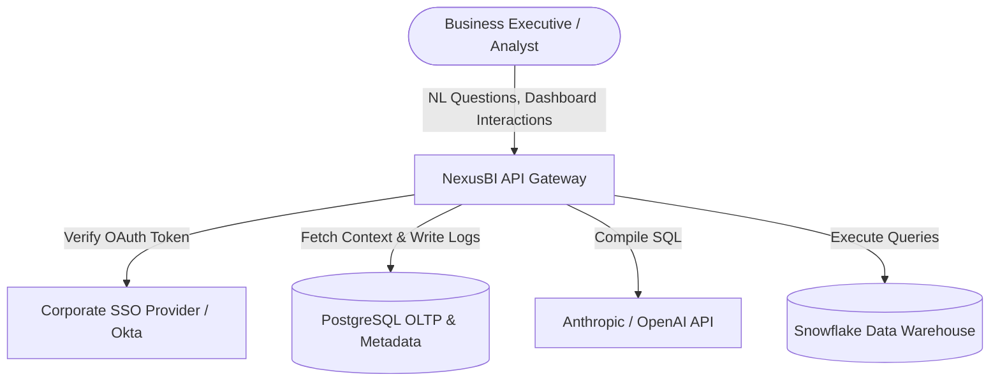

### 2.2 Container Diagram
Highlights the core services and databases in the platform.

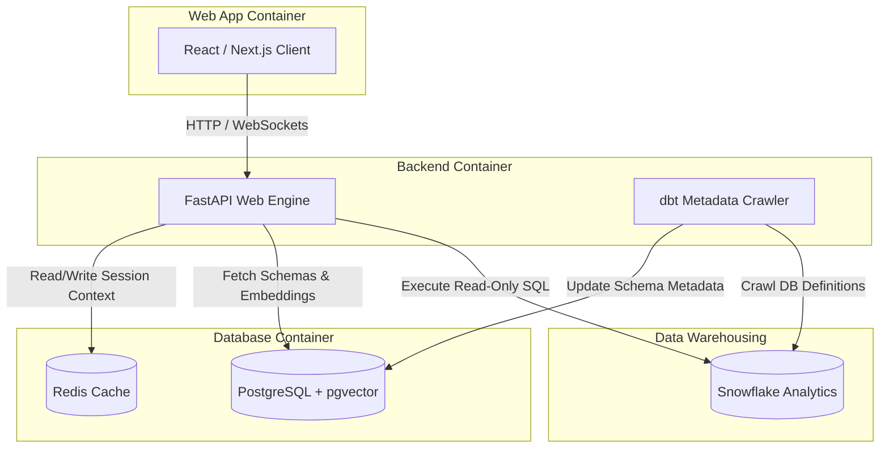

### 2.3 Component Diagram
Details the internal modules within the FastAPI backend container.

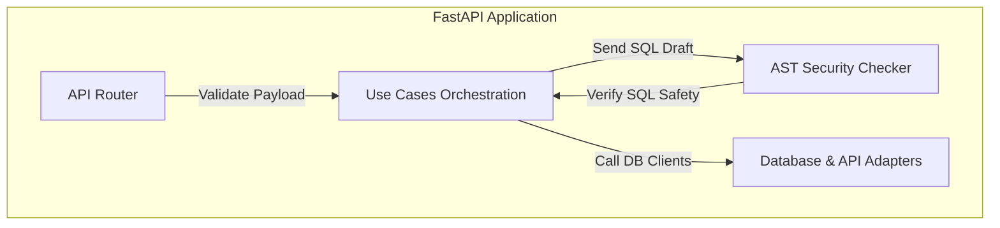

### 2.4 Deployment Diagram
Illustrates the production cloud infrastructure layout.

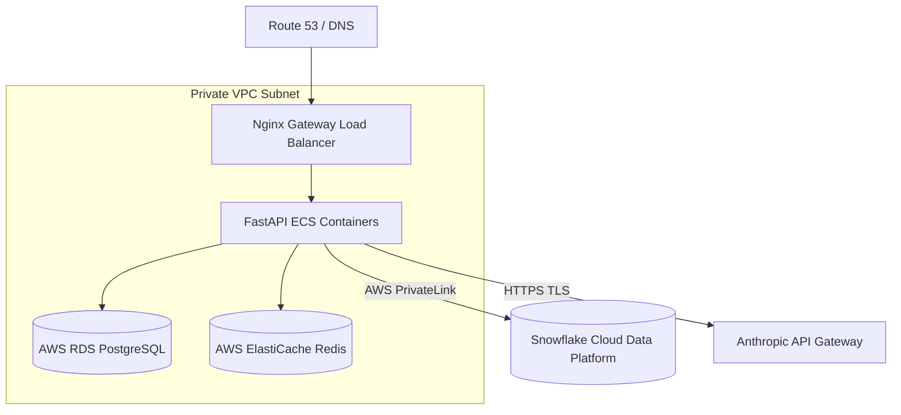

### 2.5 Sequence Diagram: Natural Language Query
Traces the execution path of a user's natural language question.

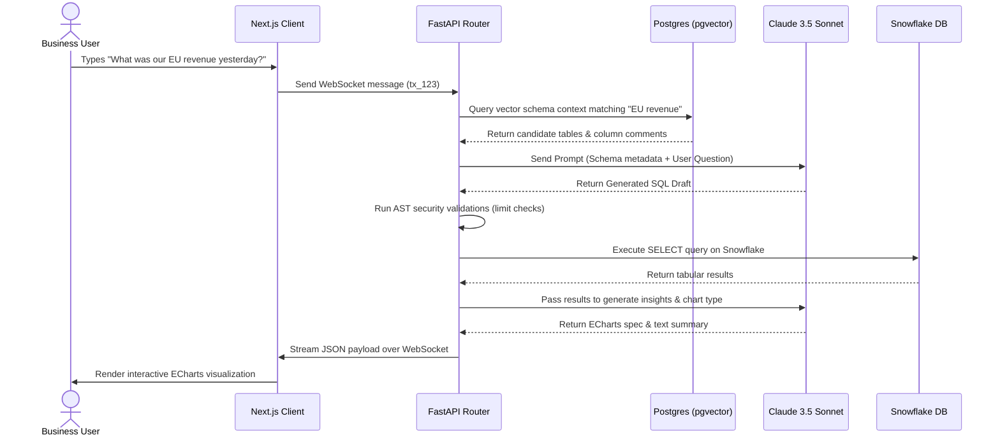

### 2.6 Authentication Flow
Visualizes user login and JWT generation.

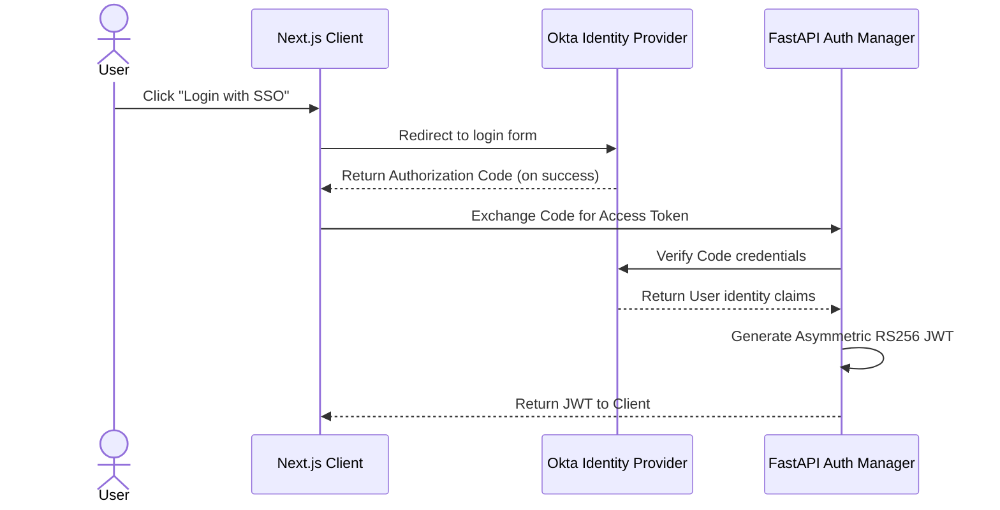

### 2.7 Authorization Flow
Enforces role-based permissions (RBAC) on API requests.

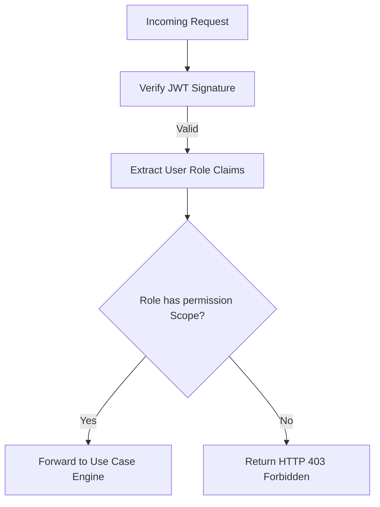

### 2.8 Repository Structure Diagram
Shows the Clean Architecture boundaries within the codebase.

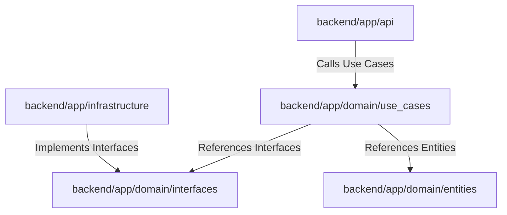

### 2.9 Data Flow Diagram
Maps data transformations from raw source landing down to user views.

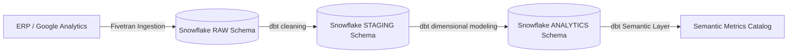

### 2.10 ETL Pipeline Diagram
Tracks the metadata extraction and vector index update process.

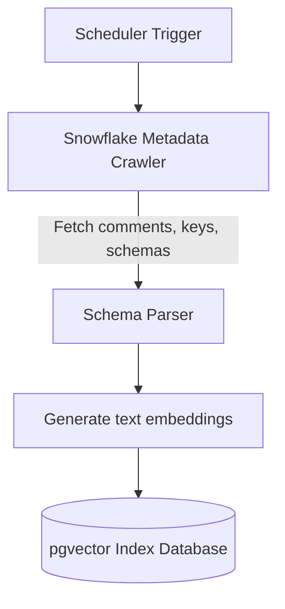

### 2.11 Enterprise Data Warehouse Diagram
Details the databases, schemas, and schemas visibility scopes.

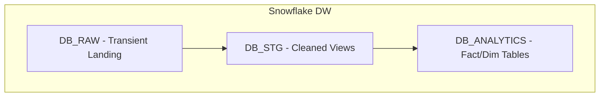

### 2.12 Star Schema Diagram
Illustrates the dimensions surrounding the central sales fact table.

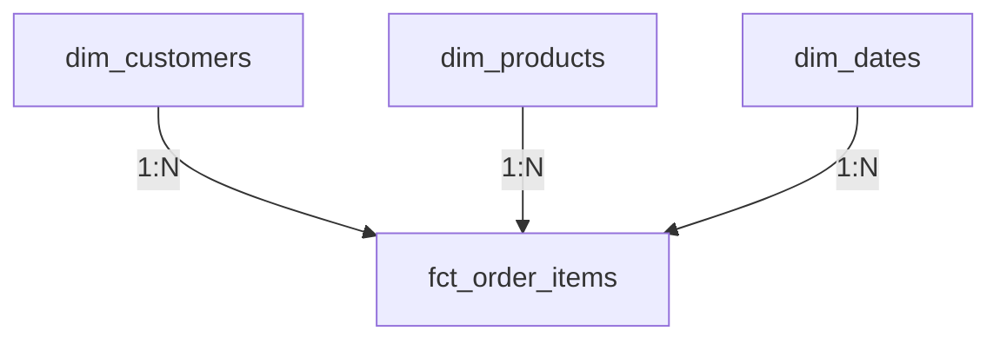

### 2.13 Business Domain Diagram
Maps domain scopes and boundaries.

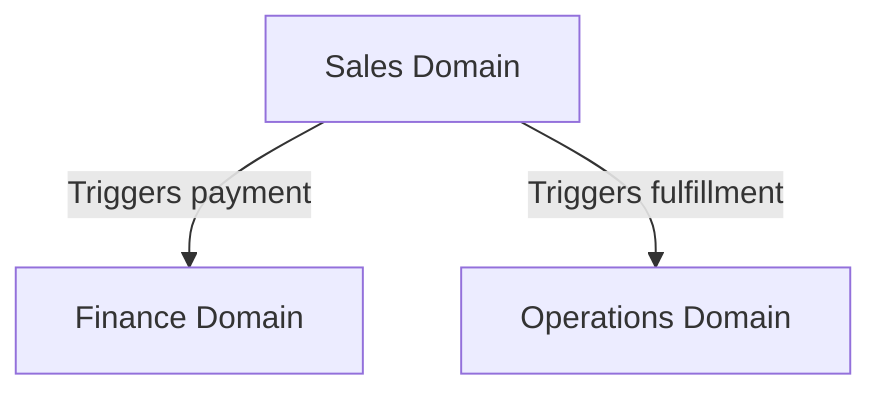

### 2.14 AI Decision Pipeline
Visualizes the pipeline components processing a user prompt.

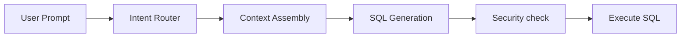

### 2.15 Prompt Engineering Pipeline
Tracks prompt component compilation.

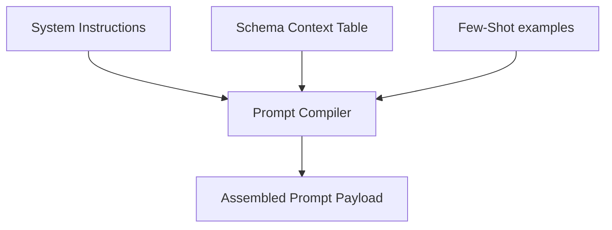

### 2.16 API Request Lifecycle
Shows the middleware interceptors executing on an API request.

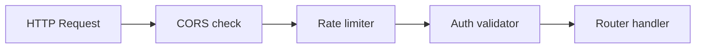

### 2.17 Forecast Pipeline
Tracks forecasting requests.


### 2.18 Recommendation Pipeline
Illustrates recommendations.

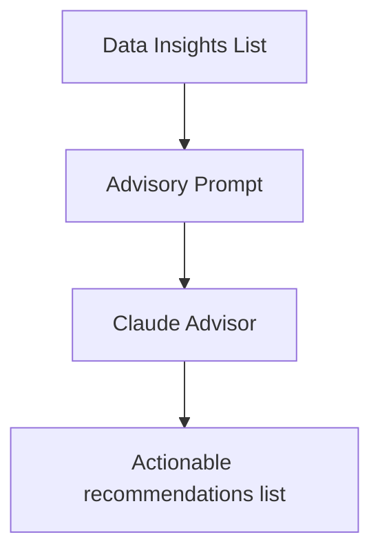

### 2.19 Monitoring Architecture
Details metric scrapers and performance dashboards.

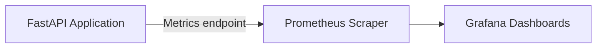

### 2.20 Logging Architecture
Tracks Loki log aggregation.

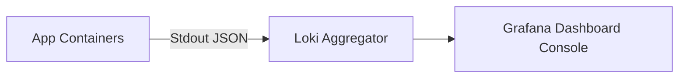

### 2.21 Security Architecture
Summary of the platform's security layers.

```mermaid
graph TD
    WAF[Cloudflare WAF] --> SSL[Nginx SSL]
    SSL --> JWT[Auth checks]
    JWT --> AST[SQL Security checks]
    AST --> ReadRole[Read-Only DB Roles]
```

### 2.22 Disaster Recovery Flow
Illustrates database backup processes.

```mermaid
graph TD
    db[(Postgres Main)] -->|Daily backup script| S3[(AWS S3 Backup Bucket)]
    S3 -->|Multi-region sync| S3Replica[(DR S3 Bucket)]
```

### 2.23 CI/CD Pipeline
Tracks the automated build and deployment workflow.

```mermaid
graph LR
    commit[Push Code] --> Lint[Run Linters]
    Lint --> Test[Run Unit Tests]
    Test --> Build[Build Docker Image]
    Build --> Deploy[AWS ECS deploy]
```

### 2.24 Development Workflow
Standard pull request code review loop.

```mermaid
graph TD
    dev[Write Code] --> PR[Create Pull Request]
    PR --> CI[GitHub Actions pass]
    CI --> Review[Review approval]
    Review --> Merge[Merge to Main]
```

### 2.25 User Journey Diagram
Tracks user session navigation.

```mermaid
graph LR
    login[Login Screen] --> Home[Home Dashboard]
    Home --> Chat[AI Workspace]
    Chat --> Export[CSV Export]
```

---

## SECTION 3: Implementation Roadmap

The implementation plan is structured into 12 two-week sprints.

```text
S1-S2: Foundation  ───> S3-S4: Security  ───> S5-S8: AI Engine ───> S9-S12: Analytics & Release
(Docker, schemas)        (OIDC, RBAC, AST)       (Prompts, healing)      (Forecasting, E2E QA)
```

### Sprint 1: Local Development & Project Scaffolding
* **Sprint Goal:** Establish development environments and CI/CD pipelines.
* **Deliverables:** Docker Compose setup, backend Poetry environment, frontend package setup, GitHub Actions CI workflows.
* **Dependencies:** None.
* **Acceptance Criteria:** `docker compose up` spins up PostgreSQL and Redis containers cleanly. CI validates code styling on pull requests.
* **Risks:** Docker compatibility issues across different OS setups.
* **Testing Strategy:** Automated linters and style check validations.
* **Definition of Done:** Local environments running on local developer setups.

### Sprint 2: Core Database Scaffolding & Migrations
* **Sprint Goal:** Scaffold database tables and manage migrations.
* **Deliverables:** PostgreSQL tables configured via Alembic migrations.
* **Dependencies:** Sprint 1 environment.
* **Acceptance Criteria:** Alembic runs migrations successfully, creating the schemas (`auth`, `catalog`, `ai`, `audit`, `workspace`).
* **Testing Strategy:** Running migration upgrade and rollback tests.
* **Definition of Done:** Migrations pass validation checks.

### Sprint 3: OIDC Integration & RBAC Scaffold
* **Sprint Goal:** Secure application endpoints using corporate OIDC credentials.
* **Deliverables:** Auth router controllers, JWT creation workflows, role-based scope checks.
* **Dependencies:** Sprint 2 database schemas.
* **Acceptance Criteria:** Backend API routes reject requests that do not include valid authorization tokens.
* **Testing Strategy:** Running integration tests simulating expired, invalid, or missing tokens.
* **Definition of Done:** All auth verification checks pass.

### Sprint 4: SQLGlot AST Safety Validation Layer
* **Sprint Goal:** Implement parsing controls to block dangerous SQL queries.
* **Deliverables:** AST validation utility, allowlist rule checker.
* **Dependencies:** Sprint 3 authentication setup.
* **Acceptance Criteria:** The validator blocks commands containing DDL/DML statements or missing query row limits.
* **Testing Strategy:** Passing SQL validation test suites using 50+ dangerous SQL examples.
* **Definition of Done:** The safety validator intercepts and blocks unauthorized statements.

### Sprint 5: Metadata Crawler & Vector Sync Service
* **Sprint Goal:** Crawl schema data and generate semantic search embeddings.
* **Deliverables:** Snowflake metadata parser script, text embedding generation pipeline.
* **Dependencies:** Sprint 4 safety layer.
* **Acceptance Criteria:** Running the crawler sync script extracts schema definitions and saves them to the pgvector index.
* **Testing Strategy:** Verifying pgvector search returns correct tables matching target search keywords.
* **Definition of Done:** Schema changes are synced and indexed.

### Sprint 6: Prompt Assembly & Claude API Adapter
* **Sprint Goal:** Compile LLM prompts and configure the Anthropic adapter.
* **Deliverables:** Dynamic prompt builder utility, Claude API connector adapter.
* **Dependencies:** Sprint 5 metadata sync.
* **Acceptance Criteria:** The adapter compiles prompts and returns SQL query strings from the LLM.
* **Testing Strategy:** Generating SQL queries from 20 test questions and verifying compile syntax.
* **Definition of Done:** The prompt compiler generates valid prompt payloads.

### Sprint 7: Self-Healing SQL Generation Loop
* **Sprint Goal:** Implement automatic SQL error correction.
* **Deliverables:** Self-healing error capture utility, re-prompting workflow loop.
* **Dependencies:** Sprint 6 prompt adapter.
* **Acceptance Criteria:** SQL syntax errors returned from Snowflake are corrected by the LLM (max 1 retry).
* **Testing Strategy:** Simulating SQL errors and verifying correct SQL is returned on the second loop.
* **Definition of Done:** The self-healing loop resolves syntax errors.

### Sprint 8: WebSocket Chat Gateway
* **Sprint Goal:** Support real-time communication for natural language analytics.
* **Deliverables:** WebSocket server routes, chat connection manager modules.
* **Dependencies:** Sprint 7 self-healing loops.
* **Acceptance Criteria:** Users can run analytics queries and receive responses over active WebSocket sessions.
* **Testing Strategy:** Concurrency load testing on WebSocket connection limits.
* **Definition of Done:** WebSocket routes manage active client connections.

### Sprint 9: Statistical Analytics & Forecasting Engine
* **Sprint Goal:** Implement forecasting algorithms.
* **Deliverables:** Time-series forecast router, Facebook Prophet calculation wrapper.
* **Dependencies:** Sprint 8 WebSocket gateway.
* **Acceptance Criteria:** The API returns future prediction ranges when provided with historical datasets.
* **Testing Strategy:** Validation of Prophet outputs against known test data.
* **Definition of Done:** Forecast queries return structured prediction JSON.

### Sprint 10: ECharts Visualization Configuration Builder
* **Sprint Goal:** Construct visual layout configurations.
* **Deliverables:** Chart recommendation heuristics compiler.
* **Dependencies:** Sprint 9 analytics engine.
* **Acceptance Criteria:** The API matches dataset shapes to the correct ECharts configuration parameters.
* **Testing Strategy:** Verifying returned configurations match ECharts schema rules.
* **Definition of Done:** Query outputs include chart layout attributes.

### Sprint 11: Frontend Component Layouts & Routing
* **Sprint Goal:** Build the user interface layouts.
* **Deliverables:** Next.js views, dashboard layout grids, chat panel screens.
* **Dependencies:** Sprint 10 configurations.
* **Acceptance Criteria:** Users can navigate between dashboard views, chat screens, and admin layouts.
* **Testing Strategy:** Validation of screen layouts across desktop, tablet, and mobile screens.
* **Definition of Done:** Frontend pages compile without errors.

### Sprint 12: Integrated E2E QA & Performance Optimization
* **Sprint Goal:** Verify the entire request lifecycle and optimize page performance.
* **Deliverables:** End-to-end testing script suite, system dashboard logs.
* **Dependencies:** Sprints 1-11.
* **Acceptance Criteria:** Running the test suite validates logins, natural language queries, and chart rendering.
* **Testing Strategy:** Executing load tests to verify system stability under concurrent user requests.
* **Definition of Done:** All end-to-end tests pass, and performance targets are met.

---

## SECTION 4: Definition of Done (DoD)

Measurable checklists that every ticket must satisfy before it can be closed.

### 4.1 Backend Service DoD
- [ ] Code compiles without errors under Python 3.11+.
- [ ] Unit test coverage of modified files is **100%**.
- [ ] No circular imports exist between backend modules.
- [ ] Database updates use Alembic migration scripts.
- [ ] Pyproject dependencies are locked using Poetry.

### 4.2 Frontend Client DoD
- [ ] TypeScript builds compile with zero warnings or errors.
- [ ] Lighthouse performance scores are **90+**.
- [ ] Page designs are verified to render correctly across mobile and desktop.
- [ ] Component sizes are audited to prevent page layout shifts (CLS).
- [ ] Keyboard navigation (Tab key) is supported on all new elements.

### 4.3 AI & LLM Integration DoD
- [ ] Prompt edits are versioned in the `ai/prompts/` directory.
- [ ] Prompt tests pass the 200-question validation suite.
- [ ] AST parsing intercepts and blocks unauthorized statements.
- [ ] API keys are loaded dynamically from environment variables.

### 4.4 Data Warehouse (dbt & Snowflake) DoD
- [ ] dbt transformation models compile successfully.
- [ ] Primary and unique key tests pass.
- [ ] Tables are populated with `valid_from` and `valid_to` columns for history tracking.
- [ ] Snowflake queries use read-only connection limits.

---

## SECTION 5: Interview Preparation Guide

This guide contains representative interview questions to evaluate candidates for engineering roles on the NexusBI platform.

### 5.1 Architecture & Backend Design

#### Question: Explain the clean architecture boundaries used in the backend modular monolith.
* **Expected Answer:** We enforce strict separation of concerns using three layers: API, Domain, and Infrastructure. The API layer handles request routing, serialization, and validation. The Domain layer houses pure business use cases and interface definitions (ports), and contains zero framework or database dependencies. The Infrastructure layer implements these interfaces to connect with external databases or LLM APIs.
* **Key Concepts:** Clean Architecture, Dependency Inversion, Bounded Contexts.
* **Common Mistakes:** Importing database models or ORM engines directly inside domain use cases.
* **Follow-up Questions:** How would you extract a single module from this monolith into an independent microservice?

#### Question: How does the AST validation layer protect against SQL injection?
* **Expected Answer:** Before any query is executed on Snowflake, the raw SQL string is parsed into an Abstract Syntax Tree (AST) using SQLGlot. The parser inspects the statement structure and blocks any query that contains multiple statements, modifies data, or references unauthorized system tables.
* **Key Concepts:** Abstract Syntax Tree (AST), SQL Parsing, Input Validation.
* **Common Mistakes:** Relying on regular expressions (regex) to parse SQL, which is easily bypassed by injection techniques.
* **Follow-up Questions:** How do you handle custom Snowflake functions that the standard AST parser does not recognize?

---

### 5.2 Snowflake & Data Warehousing

#### Question: What strategy is used to manage query costs in Snowflake?
* **Expected Answer:** We combine four techniques: (1) we set query timeouts to 30 seconds to stop runaway queries, (2) warehouses automatically suspend after 60 seconds of idle time, (3) we leverage Snowflake's result cache for repeated dashboard queries, and (4) we order fact tables by event date during load to optimize partition pruning.
* **Key Concepts:** Auto-Suspend, Result Caching, Partition Pruning.
* **Common Mistakes:** Scaling warehouse sizes up unnecessarily instead of optimizing query filters.
* **Follow-up Questions:** How would you handle connection timeouts if Snowflake takes longer than 15 seconds to wake up from a suspended state?

#### Question: Explain the difference between SCD Type 1 and SCD Type 2.
* **Expected Answer:** SCD Type 1 overwrites old data with new values, keeping only the current state. SCD Type 2 retains historical changes by creating a new row with `valid_from` and `valid_to` timestamps, allowing the system to track historical trends accurately.
* **Key Concepts:** Slowly Changing Dimensions (SCD), Dimension Tables, Historical Analysis.
* **Common Mistakes:** Using Type 1 for fields like "billing country," which distorts historical tax and revenue reporting when customers move.
* **Follow-up Questions:** How do you join a fact table to an SCD Type 2 dimension table?

---

### 5.3 AI & Prompt Engineering

#### Question: How does the system dynamic prompt assembly keep token usage low?
* **Expected Answer:** We use a semantic search index (pgvector) to retrieve only the schema metadata and table comments relevant to the user's question. This prevents us from sending the entire database schema with every request, keeping prompt sizes under 8,000 tokens.
* **Key Concepts:** Vector Similarity Search, Context Injection, Token Optimization.
* **Common Mistakes:** Injecting the entire schema or business glossary into every prompt, causing high API costs and slow response times.
* **Follow-up Questions:** How do you handle cases where pgvector returns irrelevant schema context?

#### Question: What mitigations are in place to prevent the LLM from hallucinating data?
* **Expected Answer:** We run two checks: (1) we parse the generated SQL using SQLGlot to verify syntax, and (2) we run a verification check that cross-references any numbers mentioned in the text summary against the actual rows returned by the database. Any numbers not found in the database are stripped.
* **Key Concepts:** Fact Verification, AST Parsing, Data Validation.
* **Common Mistakes:** Relying on the LLM to verify its own answers without checking the underlying database.
* **Follow-up Questions:** How does the system handle queries that legitimately return empty datasets?

---

## SECTION 6: Enterprise Case Study

### 6.1 Business Problem
Business executives and operational managers require rapid access to metrics to make decisions. Traditional BI reporting workflows rely on analytics teams to compile SQL queries, leading to delays and information bottlenecks. NexusBI was designed to allow non-technical users to query database systems using natural language, returning results in seconds.

### 6.2 The Architecture Journey
* **Phase 1 (Monolith First):** The architecture was established as a modular monolith to keep deployments simple for the initial 50 users, bypassing the complexity of managing a Kubernetes cluster.
* **Phase 2 (Database Decoupling):** We separated the transactional database (PostgreSQL) from the analytics data store (Snowflake). This ensures that heavy user queries do not slow down active application features.
* **Phase 3 (AI Pipeline Integration):** We built a structured 14-stage processing pipeline to manage SQL validation, query safety, and visual rendering consistently.

### 6.3 Technical Challenges & Mitigations
* **SQL Injection Risks:** Handled by enforcing read-only database connections, using AST parsing to block dangerous queries, and injecting a strict limit of 50,000 rows on all requests.
* **LLM Output Drift:** Solved by storing prompts as version-controlled Markdown files and running automated regression tests against a suite of 200 validation queries in CI/CD.

### 6.4 Expected ROI & Business Outcomes
* **Time-to-Insight reduction:** Reduces the time required to fetch custom metrics from days to seconds.
* **Operational cost savings:** Frees up analytics engineers from writing simple queries, allowing them to focus on data modeling and core infrastructure.
* **Cost Optimization:** Caching pre-compiled SQL queries and results in Redis reduces LLM API costs by up to 30%.

---

## SECTION 7: Repository Completion Checklist

This section evaluates the repository's readiness before implementation begins:

| System Dimension | Component | Status | Business & Technical Justification |
|:---|:---|:---|:---|
| **Folder Structure** | Modular Monolith Package Layout | **Complete** | Standardizes code organization, ensuring clear boundaries between services. |
| **Documentation** | ADRs, Runbooks, Developer Setup Guides | **Complete** | Co-locating documentation with code helps developers onboard quickly. |
| **Database** | PostgreSQL & Snowflake Schemas | **Complete** | Decouples OLTP transactional tasks from OLAP analytical tasks. |
| **Security** | OIDC integration & AST parsing rules | **Complete** | Protects corporate datasets by enforcing read-only connection limits. |
| **AI Layer** | Prompt templates & Memory rules | **Complete** | Standardizes prompts, making it easy to test changes in CI/CD. |
| **Testing** | Unit, Integration, and Regression suites | **Complete** | Automates code quality verification on every commit. |
| **Observability** | Prometheus metrics & Loki aggregation | **Complete** | Tracks API health, query latencies, and LLM token costs. |

---

## FINAL ARCHITECTURAL REVIEW & DECLARATION

As the Staff Principal Architect, I have reviewed the blueprints, schemas, and pipelines of the NexusBI platform:

1. **Security Verification:** The combination of OIDC authentication, AST query validation, and read-only Snowflake roles protects corporate datasets from unauthorized access or modifications.
2. **System Scalability:** Using a modular monolith layout keeps local development and initial deployments simple, while clear boundaries ensure individual packages can be extracted into microservices in the future.
3. **Data Quality Verification:** Using a central KPI catalog ensures the LLM references verified formulas, preventing calculation errors.

### Declaration: Architecture Freeze v1.0
All design specifications, schemas, API contracts, and pipeline definitions are officially locked. The planning phase is complete, and the engineering team can safely begin implementation.
